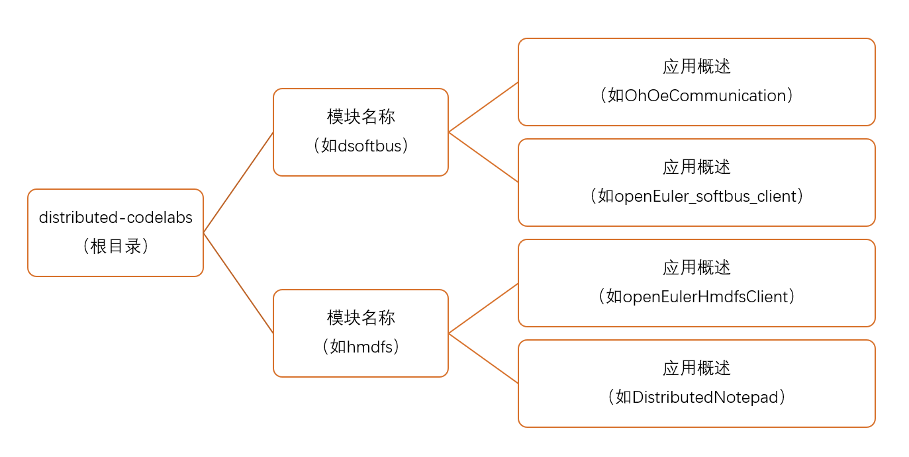

# distributed-codelabs

#### 介绍
该仓库为openEuler分布式能力的应用示例，旨在让开发者能够快速了解openEuler所具备的分布式能力以及相关的应用开发流程。非常欢迎大家参与到分布式能力应用开发中来，使能更多的应用场景。

#### 目录结构
请大家提交代码时按照如下结构，若不满足实际开发需求，请在提交时说明。

#### 目录

- 分布式软总线应用

  [openEuler和openHarmony通过分布式软总线通信](https://gitee.com/openeuler/distributed-codelabs/tree/master/dsoftbus/OhOeCommunication)

  [openEuler分布式软总线客户端示例](https://gitee.com/openeuler/distributed-codelabs/tree/master/dsoftbus/openEuler_softbus_client)

- 分布式文件应用

  

#### 参与贡献

1.  Fork 本仓库
2.  新建 Feat_xxx 分支
3.  提交代码
4.  新建 Pull Request
