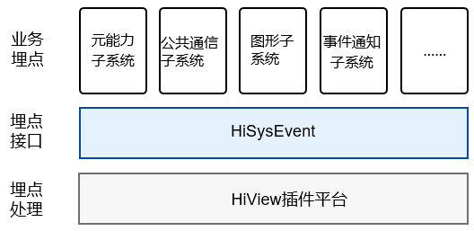

# HiSysEvent组件<a name="ZH-CN_TOPIC_0000001115694150"></a>

-   [简介](#section11660541593)
-   [目录](#section161941989596)
-   [说明](#section1312121216216)
    -   [接口说明](#section1551164914237)
    -   [使用说明](#section129654513264)

-   [相关仓](#section1371113476307)

## 简介<a name="section11660541593"></a>

HiSysEvent提供OpenHarmony埋点接口，通过在关键路径埋点记录系统在运行过程中的重要信息，辅助开发者定位问题，此外还支持开发者将数据上传到云进行大数据质量度量。

**图 1**  HiSysEvent架构图<a name="fig1514425244110"></a>  




## 目录<a name="section161941989596"></a>

```
/base/hiviewdfx/hisysevent   # hisysevent部件代码
├── adapter                  # 平台适配
│  └── native               # C++适配
├── frameworks               # 框架代码
│  └── native               # 对内部子系统暴露的C++接口
├── interfaces               # 对外接口存放目录
    └── native               # C++接口
        └── innerkits        # 对内部子系统暴露的C++接口
```

## 说明<a name="section1312121216216"></a>

### 接口说明<a name="section1551164914237"></a>

C++埋点接口如下：

**表 1**  HiSysEvent接口介绍

<a name="table1972602519328"></a>
<table><thead align="left"><tr id="row5726112593219"><th class="cellrowborder" valign="top" width="57.38999999999999%" id="mcps1.2.3.1.1"><p id="p1472602523216"><a name="p1472602523216"></a><a name="p1472602523216"></a>接口名</p>
</th>
<th class="cellrowborder" valign="top" width="42.61%" id="mcps1.2.3.1.2"><p id="p12726112512322"><a name="p12726112512322"></a><a name="p12726112512322"></a>描述</p>
</th>
</tr>
</thead>
<tbody><tr id="row47261259328"><td class="cellrowborder" valign="top" width="57.38999999999999%" headers="mcps1.2.3.1.1 "><p id="p15726112583213"><a name="p15726112583213"></a><a name="p15726112583213"></a>template&lt;typename... Types&gt; static int Write(const std::string &amp;domain, const std::string &amp;eventName, EventType type, Types... keyValues)</p>
</td>
<td class="cellrowborder" valign="top" width="42.61%" headers="mcps1.2.3.1.2 "><p id="p14727325133216"><a name="p14727325133216"></a><a name="p14727325133216"></a>接口功能：记录系统事件。</p>
<p id="p167271525203213"><a name="p167271525203213"></a><a name="p167271525203213"></a>输入参数：</p>
<a name="ul0727102516327"></a><a name="ul0727102516327"></a><ul id="ul0727102516327"><li><strong id="b2019634817576">domain</strong>：事件的相关领域，需要使用预置领域请参考Domain，可自定义领域。自定义领域长度在16个字符以内，有效的字符是0-9、a-z, A-Z、_，以字母开头。</li><li><strong id="b2019634817578">eventName</strong>：事件名，长度在32个字符以内，有效的字符是0-9、a-z, A-Z、_，以字母开头。</li><li><strong id="b2019634817579">type</strong>：事件类型，参考EventType。</li><li><strong id="b2019634817580">keyValues</strong>：事件参数键值对，支持<strong id="b2019634917677">基本类型、std::string，以及std::vector&lt;基本类型&gt;、std:vector&lt;std::string&gt;</strong>。参数名长度在48个字符以内，有效的字符是0-9、a-z, A-Z、_，以字母开头。事件参数键值对的个数不超过128个。</li></ul>
<p id="p1727152513217"><a name="p1727152513217"></a><a name="p1727152513217"></a>返回值：成功返回<strong id="b2019634817677">0</strong>，错误返回小于0的值。</p>
</td>
</tr>
</tbody>
</table>

### 使用说明<a name="section129654513264"></a>

C++接口实例

1.  源代码开发

    在类定义头文件或者类实现源文件中，包含HiSysEvent头文件：

    ```
    #include "hisysevent.h"
    ```

    假设在业务关注应用启动时间start\_app，在业务类实现相关源文件中使用（调用接口埋点）：

    ```
    HiSysEvent::Write(HiSysEvent::Domain::AAFWK, "start_app", HiSysEvent::EventType::BEHAVIOR, "app_name", "com.demo");
    ```

2.  编译设置，在BUILD.gn里增加子系统SDK依赖：

    ```
    external_deps = [ "hisysevent_native:libhisysevent" ]
    ```


## 相关仓<a name="section1371113476307"></a>

[DFX子系统](https://gitee.com/openharmony/docs/blob/master/zh-cn/readme/DFX%E5%AD%90%E7%B3%BB%E7%BB%9F.md)

[hiviewdfx\_hiview](https://gitee.com/openharmony/hiviewdfx_hiview/blob/master/README_zh.md)

[hiviewdfx\_hilog](https://gitee.com/openharmony/hiviewdfx_hilog/blob/master/README_zh.md)

[hiviewdfx\_hiappevent](https://gitee.com/openharmony/hiviewdfx_hiappevent/blob/master/README_zh.md)

**hiviewdfx\_hisysevent**

[hiviewdfx\_faultloggerd](https://gitee.com/openharmony/hiviewdfx_faultloggerd/blob/master/README_zh.md)

[hiviewdfx\_hilog\_lite](https://gitee.com/openharmony/hiviewdfx_hilog_lite/blob/master/README_zh.md)

[hiviewdfx\_hievent\_lite](https://gitee.com/openharmony/hiviewdfx_hievent_lite/blob/master/README_zh.md)

[hiviewdfx\_hiview\_lite](https://gitee.com/openharmony/hiviewdfx_hiview_lite/blob/master/README_zh.md)

