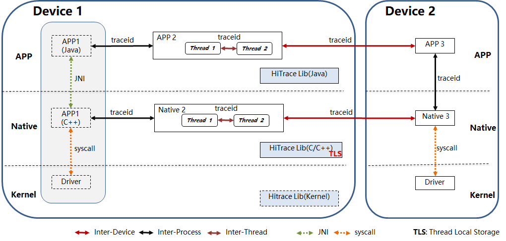

# HiTrace组件<a name="ZH-CN_TOPIC_0000001078081802"></a>

-   [简介](#section11660541593)
-   [组件框架](#section16334748141112)
-   [目录](#section161941989596)
-   [约束](#section119744591305)
-   [说明](#section1312121216216)
    -   [接口说明](#section1551164914237)
    -   [使用说明](#section129654513264)

-   [相关仓](#section1371113476317)

## 简介<a name="section11660541593"></a>

HiTrace在OpenHarmony中，为开发者提供业务流程调用链跟踪的维测接口。通过使用该接口所提供的功能，可以帮助开发者迅速获取指定业务流程调用链的运行日志、定位跨设备/跨进程/跨线程的故障问题。

## 组件框架<a name="section16334748141112"></a>

**图 1**  组件框架图<a name="fig4460722185514"></a>  




HiTrace实现机制：

-   基于云计算分布式调用链思想的轻量级实现。
-   在跨设备/跨进程/跨线程的通信机制中传递traceid。
-   在进程Native层TLS（Thread Local Storage）中存储traceid。
-   在事件、运行日志中自动附加traceid。

## 目录<a name="section161941989596"></a>

```
/base/hiviewdfx/hitrace
├── frameworks            # 框架代码
│   └── native            # HiTrace native实现代码
├── interfaces            # 接口
│   └── js                # js接口
│       └── kits          # js接口内部实现代码
│   └── native            # C/C++接口
│       └── innerkits     # 对内部子系统暴露的头文件
└── test                  # 测试用例代码
```

## 约束<a name="section119744591305"></a>

系统通用的通信机制\(IPC, EventHandler\)已支持HiTrace机制， 对业务自定义通信机制需要适配HiTrace机制。

## 说明<a name="section1312121216216"></a>

### 接口说明<a name="section1551164914237"></a>

C++主要接口：

<a name="table1764215412123"></a>
<table><tbody><tr id="row1370464111219"><td class="cellrowborder" valign="top" width="8.98%"><p id="p1670474115124"><a name="p1670474115124"></a><a name="p1670474115124"></a><strong id="b1970404151213"><a name="b1970404151213"></a><a name="b1970404151213"></a>类</strong></p>
</td>
<td class="cellrowborder" valign="top" width="27.47%"><p id="p167041041191214"><a name="p167041041191214"></a><a name="p167041041191214"></a><strong id="b5925204893112"><a name="b5925204893112"></a><a name="b5925204893112"></a>方法</strong></p>
</td>
<td class="cellrowborder" valign="top" width="63.55%"><p id="p970484112122"><a name="p970484112122"></a><a name="p970484112122"></a><strong id="b2926194820311"><a name="b2926194820311"></a><a name="b2926194820311"></a>描述</strong></p>
</td>
</tr>
<tr id="row970417418126"><td class="cellrowborder" rowspan="2" valign="top" width="8.98%"><p id="p16704184111220"><a name="p16704184111220"></a><a name="p16704184111220"></a>HiTrace</p>
</td>
<td class="cellrowborder" valign="top" width="27.47%"><p id="p1270444181220"><a name="p1270444181220"></a><a name="p1270444181220"></a>HiTraceId begin(String name, int flags)</p>
</td>
<td class="cellrowborder" valign="top" width="63.55%"><p id="p20704144114123"><a name="p20704144114123"></a><a name="p20704144114123"></a>功能：启动Hitrace跟踪，生成HiTraceId对象并设置到当前线程TLS中。</p>
<p id="p1270494114128"><a name="p1270494114128"></a><a name="p1270494114128"></a>输入参数：</p>
<p id="p370434151220"><a name="p370434151220"></a><a name="p370434151220"></a>name：业务流程名称。</p>
<p id="p9704104181212"><a name="p9704104181212"></a><a name="p9704104181212"></a>flags：跟踪指示位，可以组合使用，具体含义为：</p>
<p id="p187046416125"><a name="p187046416125"></a><a name="p187046416125"></a>HITRACE_FLAG_INCLUDE_ASYNC：同时跟踪同步调用和异步调用，缺省只跟踪同步调用。</p>
<p id="p12704104121212"><a name="p12704104121212"></a><a name="p12704104121212"></a>HITRACE_FLAG_DONOT_CREATE_SPAN：不创建子分支，缺省创建子分支。</p>
<p id="p17704104171210"><a name="p17704104171210"></a><a name="p17704104171210"></a>HITRACE_FLAG_TP_INFO：输出tracepoint信息，缺省不输出。</p>
<p id="p97041241181215"><a name="p97041241181215"></a><a name="p97041241181215"></a>HITRACE_FLAG_NO_BE_INFO：不输出起始、结束信息，缺省输出。</p>
<p id="p47041241151211"><a name="p47041241151211"></a><a name="p47041241151211"></a>HITRACE_FLAG_DONOT_ENABLE_LOG：不与日志关联输出，缺省关联。</p>
<p id="p147041741141215"><a name="p147041741141215"></a><a name="p147041741141215"></a>HITRACE_FLAG_FAULT_TRIGGER：故障触发的跟踪，缺省为正常启动的。</p>
<p id="p2704164181214"><a name="p2704164181214"></a><a name="p2704164181214"></a>HITRACE_FLAG_D2D_TP_INFO：输出设备间tracepoint信息，缺省不输出。</p>
<p id="p17704941121210"><a name="p17704941121210"></a><a name="p17704941121210"></a>HITRACE_FLAG_DEFAULT: 缺省标志。</p>
<p id="p17704174141216"><a name="p17704174141216"></a><a name="p17704174141216"></a>输出参数：无</p>
<p id="p07045418125"><a name="p07045418125"></a><a name="p07045418125"></a>返回值：启动跟踪超过返回有效HiTraceId对象，否则返回无效对象。</p>
<p id="p17041941151217"><a name="p17041941151217"></a><a name="p17041941151217"></a>注意：嵌套启动跟踪时，内层启动调用返回无效对象。</p>
</td>
</tr>
<tr id="row18704194111211"><td class="cellrowborder" valign="top"><p id="p11704641131213"><a name="p11704641131213"></a><a name="p11704641131213"></a>void end(HiTraceId id)</p>
</td>
<td class="cellrowborder" valign="top"><p id="p20704144141212"><a name="p20704144141212"></a><a name="p20704144141212"></a>功能：根据begin返回的HiTraceId停止HiTrace跟踪；清除当前线程TLS中HiTraceId内容。</p>
<p id="p7704174181215"><a name="p7704174181215"></a><a name="p7704174181215"></a>输入参数：</p>
<p id="p14704134111216"><a name="p14704134111216"></a><a name="p14704134111216"></a>id：HiTraceId对象</p>
<p id="p15704104111215"><a name="p15704104111215"></a><a name="p15704104111215"></a>输出参数：无</p>
<p id="p16704741181213"><a name="p16704741181213"></a><a name="p16704741181213"></a>返回值：无</p>
</td>
</tr>
</tbody>
</table>


## 相关仓<a name="section1371113476317"></a>

[DFX子系统](https://gitee.com/openharmony/docs/blob/master/zh-cn/readme/DFX%E5%AD%90%E7%B3%BB%E7%BB%9F.md)

[hiviewdfx\_hiview](https://gitee.com/openharmony/hiviewdfx_hiview/blob/master/README_zh.md)

[hiviewdfx\_hilog](https://gitee.com/openharmony/hiviewdfx_hilog/blob/master/README_zh.md)

[hiviewdfx\_hiappevent](https://gitee.com/openharmony/hiviewdfx_hiappevent/blob/master/README_zh.md)

[hiviewdfx\_hisysevent](https://gitee.com/openharmony/hiviewdfx_hisysevent/blob/master/README_zh.md)
