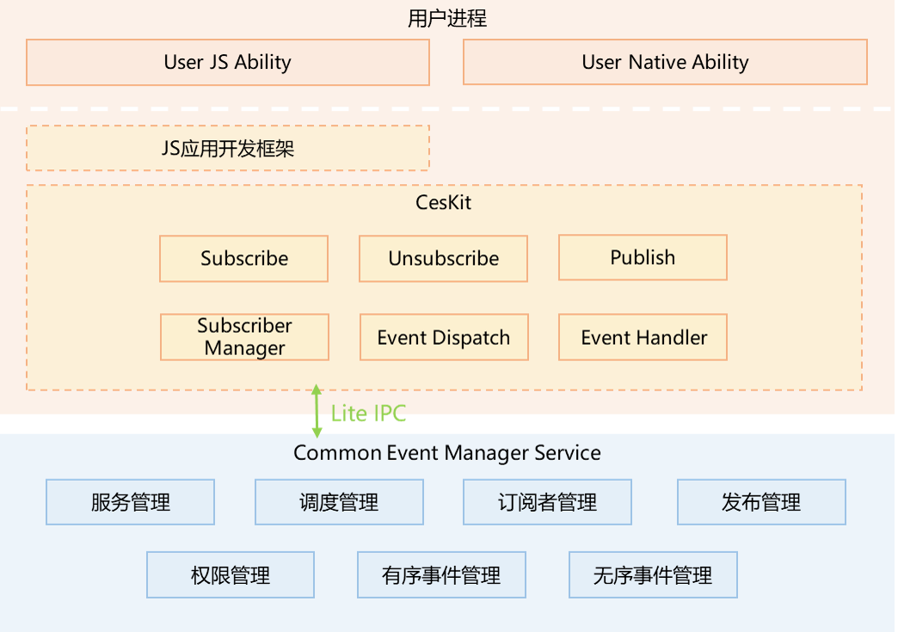

# 公共事件子系统

## 简介

OpenHarmony通过CES（Common Event Service，公共事件服务）为应用程序提供订阅、发布、退订公共事件的能力。

公共事件可分为系统公共事件和自定义公共事件。

- 系统公共事件：系统将收集到的事件信息，根据系统策略发送给订阅该事件的用户程序。 例如：系统关键服务发布的系统事件（例如：hap安装，更新，卸载等）。

- 自定义公共事件：应用自定义一些公共事件用来实现跨应用的事件通信能力。

每个应用都可以按需订阅公共事件，订阅成功且公共事件发布，系统会把其发送给应用。这些公共事件可能来自系统、其他应用和应用自身。

### 架构图

**图1** 子系统架构图




## 目录

```
/base/notification/common_event_service/
│── frameworks      # 组件目录
│   |── common/log  # 日志组件目录
│   |── core        # native接口内部实现
│   ├── native      # native接口实现
│── interface       # 对外接口声明
|   |── inner_api   # native接口声明
|   |── kits/napi   # napi接口声明
├── sa_profile      # 服务配置
├── services        # 服务实现
├── tools           # 工具实现
│── ohos.build      # 编译脚本

```


## 使用说明

### 概述

CommonEvent提供发布公共事件、创建订阅者、订阅、取消订阅等的接口。

公共事件的由string类型的event和CommonEventPublishData类型的options两部分组成，event表示公共事件的名称，options表示公共事件的属性信息。

CommonEventSubscribeInfo类型为订阅信息，用于创建公共事件订阅者，可以指定订阅者要订阅的公共事件，要求发布者需要具备的权限，订阅者的优先级等等。

CommonEventSubscriber类型为公共事件订阅者，用于获取所接受公共事件的相关信息，及设定公共事件的处理信息。

使用功能接口前，需要导入相关模块。

```js
import CommonEvent from '@ohos.commonevent';
```

### 发布公共事件

#### CommonEvent.publish(event: string, callback: AsyncCallback<void>)

- 接口说明

  发布公共事件（callback形式）

- publish参数描述

  | 名称     | 读写属性 | 类型                | 必填 | 描述                           |
  | -------- | -------- | ------------------- | ---- | ------------------------------ |
  | event    | 只读     | string              | 是   | 表示要发布的公共事件的名称     |
  | callback | 只读     | AsyncCallback<void> | 是   | 表示发布公共事件方法的回调方法 |

-

  返回值为void

- 示例

```js
import CommonEvent from '@ohos.commonevent'

function PublishCallBack(err) {
    console.info("==========================>PublishCallBack=======================>");
}

CommonEvent.publish("publish_event", PublishCallBack);
```

#### CommonEvent.publish(event: string, options: CommonEventPublishData, callback: AsyncCallback<void>)

- 接口说明

  发布公共事件指定发布信息（callback形式）

- publish参数描述

  | 名称     | 读写属性 | 类型                   | 必填 | 描述                           |
  | -------- | -------- | ---------------------- | ---- | ------------------------------ |
  | event    | 只读     | string                 | 是   | 表示要发布的公共事件的名称     |
  | options  | 只读     | CommonEventPublishData | 是   | 表示要发布的公共事件的属性信息 |
  | callback | 只读     | AsyncCallback<void>    | 是   | 表示发布公共事件方法的回调方法 |

- CommonEventPublishData类型说明

  | 名称                  | 读写属性 | 类型          | 必填 | 描述                         |
  | --------------------- | -------- | ------------- | ---- | ---------------------------- |
  | bundleName            | 只读     | string        | 否   | 表示包名称                   |
  | code                  | 只读     | int           | 否   | 表示公共事件的结果代码       |
  | data                  | 只读     | string        | 否   | 表示公共事件的自定义结果数据 |
  | subscriberPermissions | 只读     | Array<string> | 否   | 表示订阅者所需的权限         |
  | isOrdered             | 只读     | bool          | 否   | 表示是否是有序公共事件       |

-

  返回值为void

- 示例

```js
import CommonEvent from '@ohos.commonevent'

var CommonEventPublishData = {
    code: 1,
    data: "information_data",
    isOrdered: false
}

function PublishCallBack(err) {
    console.info("==========================>PublishCallBack=======================>");
}

CommonEvent.publish("publish_event", CommonEventPublishData, PublishCallBack);
```

###  创建订阅者对象
#### CommonEvent.createSubscriber(subscribeInfo: CommonEventSubscribeInfo, callback: AsyncCallback<CommonEventSubscriber>)

- 接口说明

  创建订阅者对象（callback形式）

- createSubscriber参数描述

  | 名称          | 读写属性 | 类型                                 | 必填 | 描述                     |
  | ------------- | -------- | ------------------------------------ | ---- | ------------------------ |
  | subscribeInfo | 只读     | CommonEventSubscribeInfo             | 是   | 表示订阅信息             |
  | callback      | 只读     | AsyncCallback<CommonEventSubscriber> | 是   | 表示创建订阅者的回调方法 |

- CommonEventSubscriber 类说明

  | 名称                  | 参数                                                      | 返回值                            | 描述                                                         |
  | --------------------- | --------------------------------------------------------- | --------------------------------- | ------------------------------------------------------------ |
  | getCode               | callback: AsyncCallback<number>                           | void                              | 获取公共事件的结果代码（callback形式）                       |
  | getCode               | void                                                      | Promise<number>                   | 获取公共事件的结果代码（Promise形式）                        |
  | setCode               | code: number, callback: AsyncCallback<void>               | void                              | 设置公共事件的结果代码（callback形式）                       |
  | setCode               | code: number                                              | Promise<void>                     | 设置公共事件的结果代码（Promise形式）                        |
  | getData               | callback: AsyncCallback<string>                           | void                              | 获取公共事件的结果数据（callback形式）                       |
  | getData               | void                                                      | Promise<string>                   | 获取公共事件的结果数据（Promise形式）                        |
  | setData               | data: string, callback: AsyncCallback<void>               | void                              | 设置公共事件的结果数据（callback形式）                       |
  | setData               | data: string                                              | Promise<void>                     | 设置公共事件的结果数据（Promise形式）                        |
  | setCodeAndData        | code: number, data: string, callback: AsyncCallback<void> | void                              | 设置公共事件的结果代码和结果数据（callback形式）             |
  | setCodeAndData        | code: number, data: string                                | Promise<void>                     | 设置公共事件的结果代码和结果数据（Promise形式）              |
  | isOrderedCommonEvent  | callback: AsyncCallback<boolean>                          | void                              | 查询当前公共事件的是否为有序公共事件，返回true代表是有序公共事件，false代表不是有序公共事件（callback形式） |
  | isOrderedCommonEvent  | void                                                      | Promise<bool>                     | 查询当前公共事件的是否为有序公共事件，返回true代表是有序公共事件，false代表不是有序公共事件（Promise形式） |
  | abortCommonEvent      | callback: AsyncCallback<void>                             | void                              | 取消当前的公共事件，仅对有序公共事件有效，取消后，公共事件不再向下一个订阅者传递（callback形式） |
  | abortCommonEvent      | void                                                      | Promise<void>                     | 取消当前的公共事件，仅对有序公共事件有效，取消后，公共事件不再向下一个订阅者传递（Promise形式） |
  | clearAbortCommonEvent | callback: AsyncCallback<void>                             | void                              | 清除当前有序公共事件abort状态（callback形式）                |
  | clearAbortCommonEvent | void                                                      | Promise<void>                     | 清除当前有序公共事件abort状态（Promise形式）                 |
  | getAbortCommonEvent   | callback: AsyncCallback<boolean>                          | void                              | 获取当前有序公共事件是否取消的状态（callback形式）           |
  | getAbortCommonEvent   | void                                                      | Promise<boolean>                  | 获取当前有序公共事件是否取消的状态Promise形式）              |
  | getSubscribeInfo      | callback: AsyncCallback<CommonEventSubscribeInfo>         | void                              | 获取订阅者的订阅信息（callback形式）                         |
  | getSubscribeInfo      | void                                                      | Promise<CommonEventSubscribeInfo> | 获取订阅者的订阅信息（Promise形式）                          |

- CommonEventSubscribeInfo类型说明

  | 名称                | 读写属性 | 类型          | 必填 | 描述                                                         |
  | ------------------- | -------- | ------------- | ---- | ------------------------------------------------------------ |
  | events              | 只读     | Array<string> | 是   | 表示要订阅的公共事件                                         |
  | publisherPermission | 只读     | string        | 否   | 表示发布者的权限                                             |
  | publisherDeviceId   | 只读     | int           | 否   | 表示设备ID，该值必须是同一ohos网络上的现有设备ID             |
  | userId              | 只读     | int           | 否   | 表示用户ID。此参数是可选的，默认值当前用户的ID。如果指定了此参数，则该值必须是系统中现有的用户ID。 |
  | priority            | 只读     | int           | 否   | 表示订阅者的优先级，范围为-100~1000。                        |

-

  返回值为void

- 示例

```js
import CommonEvent from '@ohos.commonevent'

var CommonEventSubscribeInfo = {
	events: ["event"]
};

function CreateSubscriberCallBack(err, data) {
    console.info("==========================>CreateSubscriberCallBack=======================>");
}

CommonEvent.createSubscriber(CommonEventSubscribeInfo, CreateSubscriberCallBack);
```


#### CommonEvent.createSubscriber(subscribeInfo: CommonEventSubscribeInfo)

- 接口说明

  创建订阅者（Promise形式）

- createSubscriber参数描述

  | 名称          | 读写属性 | 类型                     | 必填 | 描述         |
  | ------------- | -------- | ------------------------ | ---- | ------------ |
  | subscribeInfo | 只读     | CommonEventSubscribeInfo | 是   | 表示订阅信息 |

- CommonEventSubscribeInfo类型说明

  | 名称                | 读写属性 | 类型          | 必填 | 描述                                                         |
  | ------------------- | -------- | ------------- | ---- | ------------------------------------------------------------ |
  | events              | 只读     | Array<string> | 是   | 表示要发送的公共事件                                         |
  | publisherPermission | 只读     | string        | 否   | 表示发布者的权限                                             |
  | publisherDeviceId   | 只读     | int           | 否   | 表示设备ID，该值必须是同一ohos网络上的现有设备ID             |
  | userId              | 只读     | int           | 否   | 表示用户ID。此参数是可选的，默认值当前用户的ID。如果指定了此参数，则该值必须是系统中现有的用户ID。 |
  | priority            | 只读     | int           | 否   | 表示订阅者的优先级。值的范围是-100到1000                     |

-

  返回值为Promise<CommonEventSubscriber>

- 示例

```js
import CommonEvent from '@ohos.commonevent'

var CommonEventSubscribeInfo = {
	events: ["event"]
};

CommonEvent.createSubscriber(CommonEventSubscribeInfo).then((data) => {
	console.info("==========================>createSubscriberPromise=======================>");
});
```

### 订阅公共事件

#### CommonEvent.subscribe(subscriber: CommonEventSubscriber, callback: AsyncCallback<CommonEventData>)

- 接口说明

  订阅公共事件（callback形式）

- subscribe参数描述

  | 名称       | 读写属性 | 类型                           | 必填 | 描述                           |
  | ---------- | -------- | ------------------------------ | ---- | ------------------------------ |
  | subscriber | 只读     | CommonEventSubscriber          | 是   | 表示订阅者对象                 |
  | callback   | 只读     | AsyncCallback<CommonEventData> | 是   | 表示接收公共事件数据的回调函数 |

- CommonEventData类型说明

  | 名称       | 读写属性 | 类型   | 必填 | 描述                                                    |
  | ---------- | -------- | ------ | ---- | ------------------------------------------------------- |
  | event      | 只读     | string | 是   | 表示当前接收的公共事件名称                              |
  | bundleName | 只读     | string | 否   | 表示包名称                                              |
  | code       | 只读     | int    | 否   | 表示公共事件的结果代码，用于传递int类型的数据           |
  | data       | 只读     | string | 否   | 表示公共事件的自定义结果数据，用于传递string 类型的数据 |

-

  返回值为void

- 示例

  * 无序事件：

    ```js
    import CommonEvent from '@ohos.commonevent'

    var CommonEventSubscriber;
    //订阅者信息
    var CommonEventSubscribeInfo = {
    	events: ["event"]
    };
    //订阅回调
    function SubscriberCallBack(err, data) {
        console.info("==========================>SubscriberCallBack=======================>");
    }
    //创建订阅者回调
    function CreateSubscriberCallBack(err, data) {
    	console.info("==========================>CreateSubscriberCallBack=======================>");
    	CommonEventSubscriber = data;
    	//订阅事件
    	CommonEvent.subscribe(CommonEventSubscriber, SubscriberCallBack);
    }
    //创建订阅者
    CommonEvent.createSubscriber(CommonEventSubscribeInfo, CreateSubscriberCallBack);
    ```

  * 有序事件

    ```js
  import CommonEvent from '@ohos.commonevent'

    var CommonEventSubscriber1;
    var CommonEventSubscriber2;
    //订阅者信息
    var CommonEventSubscribeInfo1 = {
    	events: ["event"]
    };
    var CommonEventSubscribeInfo2 = {
    	events: ["event"]
    };
    //发布回调
    function PublishCallback(err) {
    	console.info("==========================>PublishCallback=======================>");
    }
    //setCode回调
    function setCodeCallBack(err) {
        console.info("==========================>setCodeCallBack=======================>");
    }
    //setData回调
    function setDataCallBack(err) {
        console.info("==========================>setDataCallBack=======================>");
    }
    //finish回调
    function finishCommonEventCallBack(err) {
    	console.info("==========================>finishCommonEventCallBack=======================>");
    }
    //订阅者1回调
    function SubscriberCallBack1(err, data) {
        console.info("==========================>SubscriberCallBack1=======================>");
        data.setCode(0, setCodeCallBack);
        data.setData("publish_event_change", setDataCallBack);
        data.finishCommonEvent(finishCommonEventCallBack)
    }
    //订阅者2回调
    function SubscriberCallBack2(err, data) {
        console.info("==========================>SubscriberCallBack2=======================>");
        data.finishCommonEvent(finishCommonEventCallBack)
    }

    //创建订阅者1回调
    function CreateSubscriberCallBack1(err, data) {
    	console.info("==========================>CreateSubscriberCallBack1=======================>");
    	CommonEventSubscriber1 = data;
    	await CommonEvent.subscribe(CommonEventSubscriber1, SubscriberCallBack1);
    }
    //创建订阅者2回调
    function CreateSubscriberCallBack2(err, data) {
    	console.info("==========================>CreateSubscriberCallBack2=======================>");
    	CommonEventSubscriber2 = data;
    	await CommonEvent.subscribe(CommonEventSubscriber2, SubscriberCallBack2);
    }

    //创建订阅者1
    CommonEvent.createSubscriber(CommonEventSubscribeInfo1, CreateSubscriberCallBack1);
    //创建订阅者2
    CommonEvent.createSubscriber(CommonEventSubscribeInfo2, CreateSubscriberCallBack2);

    //发布信息
    var CommonEventPublishData = {
        bundleName: "publish_event_bundleName",
        code: 1,
        data: "publish_event_init",
        isOrdered: true
    }
    //发布
    await CommonEvent.publish("event", CommonEventPublishData, PublishCallback);
    ```

###  取消订阅公共事件

#### CommonEvent.unsubscribe(subscriber: CommonEventSubscriber, callback?: AsyncCallback<void>)

- 接口说明

  创建订阅者（callback形式）

- unsubscribe参数描述

  | 名称       | 读写属性 | 类型                  | 必填 | 描述                   |
  | ---------- | -------- | --------------------- | ---- | ---------------------- |
  | subscriber | 只读     | CommonEventSubscriber | 是   | 表示订阅者对象         |
  | callback   | 只读     | AsyncCallback<void>   | 否   | 表示取消订阅的回调方法 |

-

  返回值为void

- 示例

```js
import CommonEvent from '@ohos.commonevent'

var CommonEventSubscriber;
//订阅者信息
var CommonEventSubscribeInfo = {
	events: ["event"]
};
//订阅回调
function SubscriberCallBack(err, data) {
    console.info("==========================>SubscriberCallBack=======================>");
}
//创建订阅者回调
function CreateSubscriberCallBack(err, data) {
	console.info("==========================>CreateSubscriberCallBack=======================>");
	CommonEventSubscriber = data;
	//订阅事件
	CommonEvent.subscribe(CommonEventSubscriber, SubscriberCallBack);
}
//取消订阅回调
function UnsubscriberCallBack(err) {
    console.info("==========================>UnsubscriberCallBack=======================>");
}

//创建订阅者
CommonEvent.createSubscriber(CommonEventSubscribeInfo, CreateSubscriberCallBack);
//取消订阅
CommonEvent.unsubscriber(CommonEventSubscriber, UnsubscriberCallBack);
```

### 系统公共事件定义

| 系统公共事件宏                                               | 系统公共事件名称                                            | 订阅者所需权限                                 |
| ------------------------------------------------------------ | ----------------------------------------------------------- | ---------------------------------------------- |
| COMMON_EVENT_BOOT_COMPLETED                                  | usual.event.BOOT_COMPLETED                                  | ohos.permission.RECEIVER_STARTUP_COMPLETED     |
| COMMON_EVENT_LOCKED_BOOT_COMPLETED                           | usual.event.LOCKED_BOOT_COMPLETED                           | ohos.permission.RECEIVER_STARTUP_COMPLETED     |
| COMMON_EVENT_SHUTDOWN                                        | usual.event.SHUTDOWN                                        | 无                                             |
| COMMON_EVENT_BATTERY_CHANGED                                 | usual.event.BATTERY_CHANGED                                 | 无                                             |
| COMMON_EVENT_BATTERY_LOW                                     | usual.event.BATTERY_LOW                                     | 无                                             |
| COMMON_EVENT_BATTERY_OKAY                                    | usual.event.BATTERY_OKAY                                    | 无                                             |
| COMMON_EVENT_POWER_CONNECTED                                 | usual.event.POWER_CONNECTED                                 | 无                                             |
| COMMON_EVENT_POWER_DISCONNECTED                              | usual.event.POWER_DISCONNECTED                              | 无                                             |
| COMMON_EVENT_SCREEN_OFF                                      | usual.event.SCREEN_OFF                                      | 无                                             |
| COMMON_EVENT_SCREEN_ON                                       | usual.event.SCREEN_ON                                       | 无                                             |
| COMMON_EVENT_USER_PRESENT                                    | usual.event.USER_PRESENT                                    | 无                                             |
| COMMON_EVENT_TIME_TICK                                       | usual.event.TIME_TICK                                       | 无                                             |
| COMMON_EVENT_TIME_CHANGED                                    | usual.event.TIME_CHANGED                                    | 无                                             |
| COMMON_EVENT_DATE_CHANGED                                    | usual.event.DATE_CHANGED                                    | 无                                             |
| COMMON_EVENT_TIMEZONE_CHANGED                                | usual.event.TIMEZONE_CHANGED                                | 无                                             |
| COMMON_EVENT_CLOSE_SYSTEM_DIALOGS                            | usual.event.CLOSE_SYSTEM_DIALOGS                            | 无                                             |
| COMMON_EVENT_BUNDLE_SCAN_FINISHED                            | usual.event.BUNDLE_SCAN_FINISHED                            | 无                                             |
| COMMON_EVENT_PACKAGE_ADDED                                   | usual.event.PACKAGE_ADDED                                   | 无                                             |
| COMMON_EVENT_SANDBOX_PACKAGE_ADDED                           | usual.event.SANDBOX_PACKAGE_ADDED                           | 无                                             |
| COMMON_EVENT_SANDBOX_PACKAGE_REMOVED                         | usual.event.SANDBOX_PACKAGE_REMOVED                         | 无                                             |
| COMMON_EVENT_PACKAGE_REPLACED                                | usual.event.PACKAGE_REPLACED                                | 无                                             |
| COMMON_EVENT_MY_PACKAGE_REPLACED                             | usual.event.MY_PACKAGE_REPLACED                             | 无                                             |
| COMMON_EVENT_PACKAGE_REMOVED                                 | usual.event.PACKAGE_REMOVED                                 | 无                                             |
| COMMON_EVENT_BUNDLE_REMOVED                                  | usual.event.BUNDLE_REMOVED                                  | 无                                             |
| COMMON_EVENT_PACKAGE_FULLY_REMOVED                           | usual.event.PACKAGE_FULLY_REMOVED                           | 无                                             |
| COMMON_EVENT_PACKAGE_CHANGED                                 | usual.event.PACKAGE_CHANGED                                 | 无                                             |
| COMMON_EVENT_PACKAGE_RESTARTED                               | usual.event.PACKAGE_RESTARTED                               | 无                                             |
| COMMON_EVENT_PACKAGE_DATA_CLEARED                            | usual.event.PACKAGE_DATA_CLEARED                            | 无                                             |
| COMMON_EVENT_PACKAGE_CACHE_CLEARED<sup>9+<sup>               | usual.event.PACKAGE_CACHE_CLEARED                           | 无                                             |
| COMMON_EVENT_PACKAGES_SUSPENDED                              | usual.event.PACKAGES_SUSPENDED                              | 无                                             |
| COMMON_EVENT_PACKAGES_UNSUSPENDED                            | usual.event.PACKAGES_UNSUSPENDED                            | 无                                             |
| COMMON_EVENT_MY_PACKAGE_SUSPENDED                            | usual.event.MY_PACKAGE_SUSPENDED                            | 无                                             |
| COMMON_EVENT_MY_PACKAGE_UNSUSPENDED                          | usual.event.MY_PACKAGE_UNSUSPENDED                          | 无                                             |
| COMMON_EVENT_UID_REMOVED                                     | usual.event.UID_REMOVED                                     | 无                                             |
| COMMON_EVENT_PACKAGE_FIRST_LAUNCH                            | usual.event.PACKAGE_FIRST_LAUNCH                            | 无                                             |
| COMMON_EVENT_PACKAGE_NEEDS_VERIFICATION                      | usual.event.PACKAGE_NEEDS_VERIFICATION                      | 无                                             |
| COMMON_EVENT_PACKAGE_VERIFIED                                | usual.event.PACKAGE_VERIFIED                                | 无                                             |
| COMMON_EVENT_EXTERNAL_APPLICATIONS_AVAILABLE                 | usual.event.EXTERNAL_APPLICATIONS_AVAILABLE                 | 无                                             |
| COMMON_EVENT_EXTERNAL_APPLICATIONS_UNAVAILABLE               | usual.event.EXTERNAL_APPLICATIONS_UNAVAILABLE               | 无                                             |
| COMMON_EVENT_CONFIGURATION_CHANGED                           | usual.event.CONFIGURATION_CHANGED                           | 无                                             |
| COMMON_EVENT_LOCALE_CHANGED                                  | usual.event.LOCALE_CHANGED                                  | 无                                             |
| COMMON_EVENT_MANAGE_PACKAGE_STORAGE                          | usual.event.MANAGE_PACKAGE_STORAGE                          | 无                                             |
| COMMON_EVENT_DRIVE_MODE                                      | common.event.DRIVE_MODE                                     | 无                                             |
| COMMON_EVENT_HOME_MODE                                       | common.event.HOME_MODE                                      | 无                                             |
| COMMON_EVENT_OFFICE_MODE                                     | common.event.OFFICE_MODE                                    | 无                                             |
| COMMON_EVENT_USER_STARTED                                    | usual.event.USER_STARTED                                    | 无                                             |
| COMMON_EVENT_USER_BACKGROUND                                 | usual.event.USER_BACKGROUND                                 | 无                                             |
| COMMON_EVENT_USER_FOREGROUND                                 | usual.event.USER_FOREGROUND                                 | 无                                             |
| COMMON_EVENT_USER_SWITCHED                                   | usual.event.USER_SWITCHED                                   | ohos.permission.MANAGE_LOCAL_ACCOUNTS                   |
| COMMON_EVENT_USER_STARTING                                   | usual.event.USER_STARTING                                   | ohos.permission.INTERACT_ACROSS_LOCAL_ACCOUNTS          |
| COMMON_EVENT_USER_UNLOCKED                                   | usual.event.USER_UNLOCKED                                   | 无                                             |
| COMMON_EVENT_USER_STOPPING                                   | usual.event.USER_STOPPING                                   | ohos.permission.INTERACT_ACROSS_LOCAL_ACCOUNTS          |
| COMMON_EVENT_USER_STOPPED                                    | usual.event.USER_STOPPED                                    | 无                                             |
| COMMON_EVENT_HWID_LOGIN                                      | common.event.HWID_LOGIN                                     | 无                                             |
| COMMON_EVENT_HWID_LOGOUT                                     | common.event.HWID_LOGOUT                                    | 无                                             |
| COMMON_EVENT_HWID_TOKEN_INVALID                              | common.event.HWID_TOKEN_INVALID                             | 无                                             |
| COMMON_EVENT_HWID_LOGOFF                                     | common.event.HWID_LOGOFF                                    | 无                                             |
| COMMON_EVENT_WIFI_POWER_STATE                                | usual.event.wifi.POWER_STATE                                | 无                                             |
| COMMON_EVENT_WIFI_SCAN_FINISHED                              | usual.event.wifi.SCAN_FINISHED                              | ohos.permission.LOCATION                       |
| COMMON_EVENT_WIFI_RSSI_VALUE                                 | usual.event.wifi.RSSI_VALUE                                 | ohos.permission.GET_WIFI_INFO                  |
| COMMON_EVENT_WIFI_CONN_STATE                                 | usual.event.wifi.CONN_STATE                                 | 无                                             |
| COMMON_EVENT_WIFI_HOTSPOT_STATE                              | usual.event.wifi.HOTSPOT_STATE                              | 无                                             |
| COMMON_EVENT_WIFI_AP_STA_JOIN                                | usual.event.wifi.WIFI_HS_STA_JOIN                           | ohos.permission.GET_WIFI_INFO                  |
| COMMON_EVENT_WIFI_AP_STA_LEAVE                               | usual.event.wifi.WIFI_HS_STA_LEAVE                          | ohos.permission.GET_WIFI_INFO                  |
| COMMON_EVENT_WIFI_MPLINK_STATE_CHANGE                        | usual.event.wifi.mplink.STATE_CHANGE                        | ohos.permission.MPLINK_CHANGE_STATE            |
| COMMON_EVENT_WIFI_P2P_CONN_STATE                             | usual.event.wifi.p2p.CONN_STATE_CHANGE                      | ohos.permission.GET_WIFI_INFO                  |
| COMMON_EVENT_WIFI_P2P_STATE_CHANGED                          | usual.event.wifi.p2p.STATE_CHANGE                           | ohos.permission.GET_WIFI_INFO                  |
| COMMON_EVENT_WIFI_P2P_PEERS_STATE_CHANGED                    | usual.event.wifi.p2p.DEVICES_CHANGE                         | ohos.permission.GET_WIFI_INFO                  |
| COMMON_EVENT_WIFI_P2P_PEERS_DISCOVERY_STATE_CHANGED          | usual.event.wifi.p2p.PEER_DISCOVERY_STATE_CHANGE            | ohos.permission.GET_WIFI_INFO                  |
| COMMON_EVENT_WIFI_P2P_CURRENT_DEVICE_STATE_CHANGED           | usual.event.wifi.p2p.CURRENT_DEVICE_CHANGE                  | ohos.permission.GET_WIFI_INFO                  |
| COMMON_EVENT_WIFI_P2P_GROUP_STATE_CHANGED                    | usual.event.wifi.p2p.GROUP_STATE_CHANGED                    | ohos.permission.GET_WIFI_INFO                  |
| COMMON_EVENT_BLUETOOTH_HANDSFREE_AG_CONNECT_STATE_UPDATE     | usual.event.bluetooth.handsfree.ag.CONNECT_STATE_UPDATE     | ohos.permission.USE_BLUETOOTH                  |
| COMMON_EVENT_BLUETOOTH_HANDSFREE_AG_CURRENT_DEVICE_UPDATE    | usual.event.bluetooth.handsfree.ag.CURRENT_DEVICE_UPDATE    | ohos.permission.USE_BLUETOOTH                  |
| COMMON_EVENT_BLUETOOTH_HANDSFREE_AG_AUDIO_STATE_UPDATE       | usual.event.bluetooth.handsfree.ag.AUDIO_STATE_UPDATE       | ohos.permission.USE_BLUETOOTH                  |
| COMMON_EVENT_BLUETOOTH_A2DPSOURCE_CONNECT_STATE_UPDATE       | usual.event.bluetooth.a2dpsource.CONNECT_STATE_UPDATE       | ohos.permission.USE_BLUETOOTH                  |
| COMMON_EVENT_BLUETOOTH_A2DPSOURCE_CURRENT_DEVICE_UPDATE      | usual.event.bluetooth.a2dpsource.CURRENT_DEVICE_UPDATE      | ohos.permission.USE_BLUETOOTH                  |
| COMMON_EVENT_BLUETOOTH_A2DPSOURCE_PLAYING_STATE_UPDATE       | usual.event.bluetooth.a2dpsource.PLAYING_STATE_UPDATE       | ohos.permission.USE_BLUETOOTH                  |
| COMMON_EVENT_BLUETOOTH_A2DPSOURCE_AVRCP_CONNECT_STATE_UPDATE | usual.event.bluetooth.a2dpsource.AVRCP_CONNECT_STATE_UPDATE | ohos.permission.USE_BLUETOOTH                  |
| COMMON_EVENT_BLUETOOTH_A2DPSOURCE_CODEC_VALUE_UPDATE         | usual.event.bluetooth.a2dpsource.CODEC_VALUE_UPDATE         | ohos.permission.USE_BLUETOOTH                  |
| COMMON_EVENT_BLUETOOTH_REMOTEDEVICE_DISCOVERED               | usual.event.bluetooth.remotedevice.DISCOVERED               | ohos.permission.USE_BLUETOOTH                  |
| COMMON_EVENT_BLUETOOTH_REMOTEDEVICE_CLASS_VALUE_UPDATE       | usual.event.bluetooth.remotedevice.CLASS_VALUE_UPDATE       | ohos.permission.USE_BLUETOOTH                  |
| COMMON_EVENT_BLUETOOTH_REMOTEDEVICE_ACL_CONNECTED            | usual.event.bluetooth.remotedevice.ACL_CONNECTED            | ohos.permission.USE_BLUETOOTH                  |
| COMMON_EVENT_BLUETOOTH_REMOTEDEVICE_ACL_DISCONNECTED         | usual.event.bluetooth.remotedevice.ACL_DISCONNECTED         | ohos.permission.USE_BLUETOOTH                  |
| COMMON_EVENT_BLUETOOTH_REMOTEDEVICE_NAME_UPDATE              | usual.event.bluetooth.remotedevice.NAME_UPDATE              | ohos.permission.USE_BLUETOOTH                  |
| COMMON_EVENT_BLUETOOTH_REMOTEDEVICE_PAIR_STATE               | usual.event.bluetooth.remotedevice.PAIR_STATE               | ohos.permission.USE_BLUETOOTH                  |
| COMMON_EVENT_BLUETOOTH_REMOTEDEVICE_BATTERY_VALUE_UPDATE     | usual.event.bluetooth.remotedevice.BATTERY_VALUE_UPDATE     | ohos.permission.USE_BLUETOOTH                  |
| COMMON_EVENT_BLUETOOTH_REMOTEDEVICE_SDP_RESULT               | usual.event.bluetooth.remotedevice.SDP_RESULT               | 无                                             |
| COMMON_EVENT_BLUETOOTH_REMOTEDEVICE_UUID_VALUE               | usual.event.bluetooth.remotedevice.UUID_VALUE               | ohos.permission.DISCOVER_BLUETOOTH             |
| COMMON_EVENT_BLUETOOTH_REMOTEDEVICE_PAIRING_REQ              | usual.event.bluetooth.remotedevice.PAIRING_REQ              | ohos.permission.DISCOVER_BLUETOOTH             |
| COMMON_EVENT_BLUETOOTH_REMOTEDEVICE_PAIRING_CANCEL           | usual.event.bluetooth.remotedevice.PAIRING_CANCEL           | 无                                             |
| COMMON_EVENT_BLUETOOTH_REMOTEDEVICE_CONNECT_REQ              | usual.event.bluetooth.remotedevice.CONNECT_REQ              | 无                                             |
| COMMON_EVENT_BLUETOOTH_REMOTEDEVICE_CONNECT_REPLY            | usual.event.bluetooth.remotedevice.CONNECT_REPLY            | 无                                             |
| COMMON_EVENT_BLUETOOTH_REMOTEDEVICE_CONNECT_CANCEL           | usual.event.bluetooth.remotedevice.CONNECT_CANCEL           | 无                                             |
| COMMON_EVENT_BLUETOOTH_HANDSFREEUNIT_CONNECT_STATE_UPDATE    | usual.event.bluetooth.handsfreeunit.CONNECT_STATE_UPDATE    | 无                                             |
| COMMON_EVENT_BLUETOOTH_HANDSFREEUNIT_AUDIO_STATE_UPDATE      | usual.event.bluetooth.handsfreeunit.AUDIO_STATE_UPDATE      | 无                                             |
| COMMON_EVENT_BLUETOOTH_HANDSFREEUNIT_AG_COMMON_EVENT         | usual.event.bluetooth.handsfreeunit.AG_COMMON_EVENT         | 无                                             |
| COMMON_EVENT_BLUETOOTH_HANDSFREEUNIT_AG_CALL_STATE_UPDATE    | usual.event.bluetooth.handsfreeunit.AG_CALL_STATE_UPDATE    | 无                                             |
| COMMON_EVENT_BLUETOOTH_HOST_STATE_UPDATE                     | usual.event.bluetooth.host.STATE_UPDATE                     | 无                                             |
| COMMON_EVENT_BLUETOOTH_HOST_REQ_DISCOVERABLE                 | usual.event.bluetooth.host.REQ_DISCOVERABLE                 | 无                                             |
| COMMON_EVENT_BLUETOOTH_HOST_REQ_ENABLE                       | usual.event.bluetooth.host.REQ_ENABLE                       | ohos.permission.USE_BLUETOOTH                  |
| COMMON_EVENT_BLUETOOTH_HOST_REQ_DISABLE                      | usual.event.bluetooth.host.REQ_DISABLE                      | ohos.permission.USE_BLUETOOTH                  |
| COMMON_EVENT_BLUETOOTH_HOST_SCAN_MODE_UPDATE                 | usual.event.bluetooth.host.SCAN_MODE_UPDATE                 | ohos.permission.USE_BLUETOOTH                  |
| COMMON_EVENT_BLUETOOTH_HOST_DISCOVERY_STARTED                | usual.event.bluetooth.host.DISCOVERY_STARTED                | ohos.permission.USE_BLUETOOTH                  |
| COMMON_EVENT_BLUETOOTH_HOST_DISCOVERY_FINISHED               | usual.event.bluetooth.host.DISCOVERY_FINISHED               | ohos.permission.USE_BLUETOOTH                  |
| COMMON_EVENT_BLUETOOTH_HOST_NAME_UPDATE                      | usual.event.bluetooth.host.NAME_UPDATE                      | ohos.permission.USE_BLUETOOTH                  |
| COMMON_EVENT_BLUETOOTH_A2DPSINK_CONNECT_STATE_UPDATE         | usual.event.bluetooth.a2dpsink.CONNECT_STATE_UPDATE         | ohos.permission.USE_BLUETOOTH                  |
| COMMON_EVENT_BLUETOOTH_A2DPSINK_PLAYING_STATE_UPDATE         | usual.event.bluetooth.a2dpsink.PLAYING_STATE_UPDATE         | ohos.permission.USE_BLUETOOTH                  |
| COMMON_EVENT_BLUETOOTH_A2DPSINK_AUDIO_STATE_UPDATE           | usual.event.bluetooth.a2dpsink.AUDIO_STATE_UPDATE           | ohos.permission.USE_BLUETOOTH                  |
| COMMON_EVENT_NFC_ACTION_ADAPTER_STATE_CHANGED                | usual.event.nfc.action.ADAPTER_STATE_CHANGED                | 无                                             |
| COMMON_EVENT_NFC_ACTION_RF_FIELD_ON_DETECTED                 | usual.event.nfc.action.RF_FIELD_ON_DETECTED                 | ohos.permission.MANAGE_SECURE_SETTINGS         |
| COMMON_EVENT_NFC_ACTION_RF_FIELD_OFF_DETECTED                | usual.event.nfc.action.RF_FIELD_OFF_DETECTED                | ohos.permission.MANAGE_SECURE_SETTINGS         |
| COMMON_EVENT_DISCHARGING                                     | usual.event.DISCHARGING                                     | 无                                             |
| COMMON_EVENT_CHARGING                                        | usual.event.CHARGING                                        | 无                                             |
| COMMON_EVENT_DEVICE_IDLE_MODE_CHANGED                        | usual.event.DEVICE_IDLE_MODE_CHANGED                        | 无                                             |
| COMMON_EVENT_POWER_SAVE_MODE_CHANGED                         | usual.event.POWER_SAVE_MODE_CHANGED                         | 无                                             |
| COMMON_EVENT_USER_ADDED                                      | usual.event.USER_ADDED                                      | ohos.permission.MANAGE_LOCAL_ACCOUNTS                   |
| COMMON_EVENT_USER_REMOVED                                    | usual.event.USER_REMOVED                                    | ohos.permission.MANAGE_LOCAL_ACCOUNTS                   |
| COMMON_EVENT_ABILITY_ADDED                                   | common.event.ABILITY_ADDED                                  | ohos.permission.LISTEN_BUNDLE_CHANGE           |
| COMMON_EVENT_ABILITY_REMOVED                                 | common.event.ABILITY_REMOVED                                | ohos.permission.LISTEN_BUNDLE_CHANGE           |
| COMMON_EVENT_ABILITY_UPDATED                                 | common.event.ABILITY_UPDATED                                | ohos.permission.LISTEN_BUNDLE_CHANGE           |
| COMMON_EVENT_LOCATION_MODE_STATE_CHANGED                     | usual.event.location.MODE_STATE_CHANGED                     | 无                                             |
| COMMON_EVENT_IVI_SLEEP                                       | common.event.IVI_SLEEP                                      | 无                                             |
| COMMON_EVENT_IVI_PAUSE                                       | common.event.IVI_PAUSE                                      | 无                                             |
| COMMON_EVENT_IVI_STANDBY                                     | common.event.IVI_STANDBY                                    | 无                                             |
| COMMON_EVENT_IVI_LASTMODE_SAVE                               | common.event.IVI_LASTMODE_SAVE                              | 无                                             |
| COMMON_EVENT_IVI_VOLTAGE_ABNORMAL                            | common.event.IVI_VOLTAGE_ABNORMAL                           | 无                                             |
| COMMON_EVENT_IVI_HIGH_TEMPERATURE                            | common.event.IVI_HIGH_TEMPERATURE                           | 无                                             |
| COMMON_EVENT_IVI_EXTREME_TEMPERATURE                         | common.event.IVI_EXTREME_TEMPERATURE                        | 无                                             |
| COMMON_EVENT_IVI_TEMPERATURE_ABNORMAL                        | common.event.IVI_TEMPERATURE_ABNORMAL                       | 无                                             |
| COMMON_EVENT_IVI_VOLTAGE_RECOVERY                            | common.event.IVI_VOLTAGE_RECOVERY                           | 无                                             |
| COMMON_EVENT_IVI_TEMPERATURE_RECOVERY                        | common.event.IVI_TEMPERATURE_RECOVERY                       | 无                                             |
| COMMON_EVENT_IVI_ACTIVE                                      | common.event.IVI_ACTIVE                                     | 无                                             |
|COMMON_EVENT_USB_STATE                                        | usual.event.hardware.usb.action.USB_STATE                   | 无                                             |
|COMMON_EVENT_USB_PORT_CHANGED                                 | usual.event.hardware.usb.action.USB_PORT_CHANGED            | 无                                             |
| COMMON_EVENT_USB_DEVICE_ATTACHED                             | usual.event.hardware.usb.action.USB_DEVICE_ATTACHED         | 无                                             |
| COMMON_EVENT_USB_DEVICE_DETACHED                             | usual.event.hardware.usb.action.USB_DEVICE_DETACHED         | 无                                             |
| COMMON_EVENT_USB_ACCESSORY_ATTACHED                          | usual.event.hardware.usb.action.USB_ACCESSORY_ATTACHED      | 无                                             |
| COMMON_EVENT_USB_ACCESSORY_DETACHED                          | usual.event.hardware.usb.action.USB_ACCESSORY_DETACHED      | 无                                             |
| COMMON_EVENT_DISK_REMOVED                                    | usual.event.data.DISK_REMOVED                               | ohos.permission.WRITE_USER_STORAGE             |
| COMMON_EVENT_DISK_UNMOUNTED                                  | usual.event.data.DISK_UNMOUNTED                             | ohos.permission.WRITE_USER_STORAGE             |
| COMMON_EVENT_DISK_MOUNTED                                    | usual.event.data.DISK_MOUNTED                               | ohos.permission.WRITE_USER_STORAGE             |
| COMMON_EVENT_DISK_BAD_REMOVAL                                | usual.event.data.DISK_BAD_REMOVAL                           | ohos.permission.WRITE_USER_STORAGE             |
| COMMON_EVENT_DISK_UNMOUNTABLE                                | usual.event.data.DISK_UNMOUNTABLE                           | ohos.permission.WRITE_USER_STORAGE             |
| COMMON_EVENT_DISK_EJECT                                      | usual.event.data.DISK_EJECT                                 | ohos.permission.WRITE_USER_STORAGE             |
| COMMON_EVENT_VISIBLE_ACCOUNTS_UPDATED                        | usual.event.data.VISIBLE_ACCOUNTS_UPDATED                   | ohos.permission.GET_APP_ACCOUNTS               |
| COMMON_EVENT_ACCOUNT_DELETED                                 | usual.event.data.ACCOUNT_DELETED                            | ohos.permission.INTERACT_ACROSS_LOCAL_ACCOUNTS |
| COMMON_EVENT_FOUNDATION_READY                                | common.event.FOUNDATION_READY                               | ohos.permission.RECEIVER_STARTUP_COMPLETED     |
| COMMON_EVENT_AIRPLANE_MODE_CHANGED                           | usual.event.AIRPLANE_MODE                                   | 无                                             |
| COMMON_EVENT_QUICK_FIX_APPLY_RESULT<sup>9+<sup> | usual.event.QUICK_FIX_APPLY_RESULT | 无 |

## 相关仓

**[公共事件子系统](https://gitee.com/openharmony/notification_common_event_service/blob/master/README_zh.md)**

[通知子系统](https://gitee.com/openharmony/notification_distributed_notification_service/blob/master/README_zh.md)