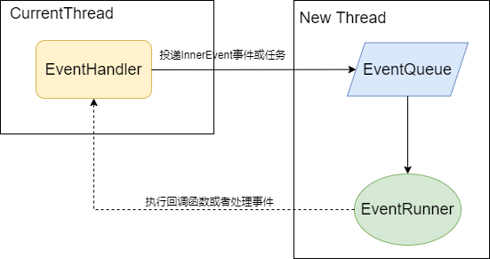

# Eventhandler部件

## 简介
​        EventHandler提供了OpenHarmony线程间通信的基本能力，可以通过EventRunner创建新线程，将耗时的操作抛到新线程上执行，从而实现在不阻塞原来的线程的基础上合理地处理耗时任务。

​        EventHandler主要包括如下核心类：

| 类           | 功能介绍                                                     |
| ------------ | ------------------------------------------------------------ |
| EventRunner  | 消息队列的循环分发器，每个线程只有一个EventRunner，主要用于管理消息队列EventQueue,不断地从队列中取出InnerEvent分发至对应的EventHandler处理。 |
| InnerEvent   | 线程之间消息传递的实体封装，EventHandler接收与处理的消息对象。EventHandler待处理的InnerEvent的优先级可在IMMEDIATE、HIGH、LOW、IDLE中选择，并设置合适的delayTime。 |
| EventHandler | 发送和处理消息的核心类，通过绑定一个EventRunner实现对消息队列进行循环分发的功能。 |
| EventQueue   | 线程消息队列，管理InnerEvent，在初始化EventRunner对象时需要创建一个与之关联的EventQueue。 |


### 架构图

**图1** 子系统架构图




## 目录

```
base/notification/eventhandler
├── interfaces
│   ├── inner_api                      # 内部接口存放目录
│   └── kits                           # 外部接口存放目录
│       └── native                     # C/C++接口
├── frameworks                         # 包管理服务框架代码
│   ├── eventhandler                   # 内部实现存放目录
│   ├── napi                           # js接口实现存放目录
│   └── native                         # C/C++接口实现存放目录
└── test                               # 测试目录
```


## 编译构建

 ./build.sh --product-name xxxx --build-target eventhandler


## 接口说明

详见[API接口说明文档](https://gitee.com/openharmony/docs/blob/master/zh-cn/application-dev/reference/apis/js-apis-emitter.md)。


## 相关仓

[HiTrace组件](https://gitee.com/openharmony/hiviewdfx_hitrace/blob/master/README_zh.md)

[HiChecker组件](https://gitee.com/openharmony/hiviewdfx_hichecker/blob/master/README_zh.md)