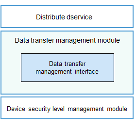

# Data Transfer Management<a name="EN-US_TOPIC_0000001150002727"></a>


## Introduction<a name="section11660541593"></a>

In OpenHarmony, the data transfer management module provides cross-device data transfer management and control policies for distributed services. The data transfer management module defines a sef of APIs to provide management and control policies for cross-device data transmission and obtain the highest risk level of data to be sent to the peer device.

The figure below illustrates the deployment logic of the data transfer management module.



-   Distributed service: provides distributed data management capabilities, including the distributed file system and distributed data management.

-   Data transfer management module: provides management and control policies for cross-device data transmission and obtains the highest risk level of data to be sent to the peer device.

-   Device security level management module: provides device security level information for data transfer management and control.

Before data is transferred, the distributed service checks whether the security level of the peer device supports the risk level of the data to be transferred. The table below lists the mappings between the device security levels and data risk levels.

**Table 1** Mappings between data risk levels and device security levels

| **Device Security Level**| **SL5**   | **SL4**   | **SL3**   | **SL2**   | **SL1**   |
| ---------------- | --------- | --------- | --------- | --------- | --------- |
| **Data Risk Level**| **S0 to S4** | **S0 to S4** | **S0 to S3** | **S0 to S2** | **S0 to S1** |

The distributed service blocks data transmission based on the data risk level returned by the data transfer management module. Before data transmission is denied, a dialog box can be displayed to ask for user's permission. Data can be transferred if the user allows. The device vendors can implement the authorization mechanism.


## Directory Structure<a name="section161941989596"></a>

```
/base/security/dataclassification
├── frameworks                   # Framework code
│   └── datatransmitmgr          # Code of basic functions
└── interfaces                   # APIs
    ── innerkits                # Internal APIs
        └── datatransmitmgr      # Code of internal APIs
```

## Available APIs<a name="section1312121216216"></a>

**Table 2** APIs of the data transfer management module

| API                                                      | Description                                  |
| ------------------------------------------------------------ | -------------------------------------- |
| int32_t DATASL_GetHighestSecLevel(DEVSLQueryParams *queryParams, uint32_t *levelInfo); | Obtains the data risk levels supported by the device.    |
| int32_t DATASL_GetHighestSecLevelAsync(DEVSLQueryParams *queryParams, HigestSecInfoCallback *callback); | Asynchronously obtains the data risk levels supported by the device.|
| int32_t DATASL_OnStart(void);                                | Starts initialization.                          |
| void DATASL_OnStop(void);                                    | Stops initialization.                        |


## Repositories Involved<a name="section1371113476307"></a>

**Security subsystem**

base/security/dataclassification
