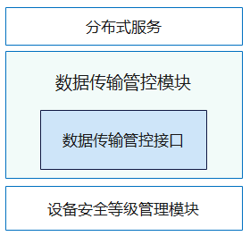

# 数据传输管控<a name="ZH-CN_TOPIC_0000001150002727"></a>

-   [简介](#section11660541593)
-   [目录](#section161941989596)
-   [接口说明](#section1312121216216)
-   [相关仓](#section1371113476307)

## 简介<a name="section11660541593"></a>

在OpenHarmony中，数据传输管控模块负责为分布式服务提供跨设备传输时的管控策略。数据传输管控模块提供了数据传输管控相关的接口定义。

数据传输管控模块当前提供如下接口定义：

-   数据传输管控接口：为分布式服务提供数据跨设备传输时的管控策略，获取允许发送到对端设备的数据的最高风险等级。

为实现上述接口定义，数据传输管控模块当前包含数据传输管控接口，其部署逻辑如下图：



-   分布式服务：提供分布式数据管理能力的分布式服务，包含分布式文件系统、分布式数据管理等。

-   数据传输管控模块：为分布式服务提供数据跨设备传输时的管控策略，获取允许发送到对端设备的数据的最高风险等级。

-   设备安全等级管理模块：为数据传输管控提供设备安全等级信息。

系统中涉及提供数据访问能力分布式服务，在发起数据传输前，需要确认对端设备的安全等级是否能满足当前数据风险等级的要求，即满足下表所示的管控要求：

**表 1**  各安全等级的设备可支持的数据风险等级映射表

| **设备安全等级** | **SL5**   | **SL4**   | **SL3**   | **SL2**   | **SL1**   |
| ---------------- | --------- | --------- | --------- | --------- | --------- |
| **数据风险等级** | **S0~S4** | **S0~S4** | **S0~S3** | **S0~S2** | **S0~S1** |

分布式服务根据数据传输管控返回的数据风险等级实施默认拦截。在数据传输被拦截时，用户可授权放通（如，弹框并经用户确认后即可放通数据传输），设备厂商可自行实现该放通授权机制。


## 目录<a name="section161941989596"></a>

```
/base/security/dataclassification
├── frameworks                   # 框架层
│   └── datatransmitmgr          # 基础功能代码存放目录
└── interfaces                   # 接口层
    └── innerkits                # 内部接口层
        └── datatransmitmgr      # 内部接口代码存放目录
```

## 接口说明<a name="section1312121216216"></a>

**表 2**  数据传输管控提供的API接口功能介绍

| 接口名                                                       | 描述                                   |
| ------------------------------------------------------------ | -------------------------------------- |
| int32_t DATASL_GetHighestSecLevel(DEVSLQueryParams *queryParams, uint32_t *levelInfo); | 获取对应设备可支持的数据风险等级。     |
| int32_t DATASL_GetHighestSecLevelAsync(DEVSLQueryParams *queryParams, HigestSecInfoCallback *callback); | 异步获取对应设备可支持的数据风险等级。 |
| int32_t DATASL_OnStart(void);                                | 模块初始化。                           |
| void DATASL_OnStop(void);                                    | 模块去初始化。                         |


## 相关仓<a name="section1371113476307"></a>

**安全子系统**

base/security/dataclassification

