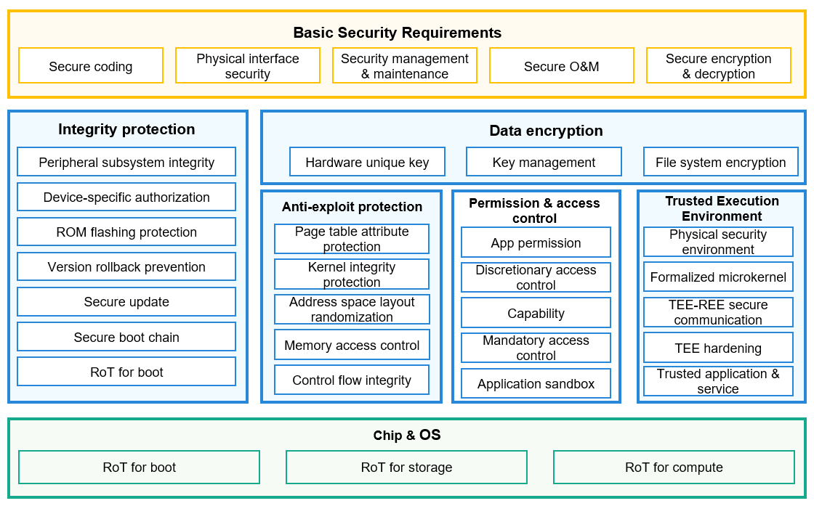
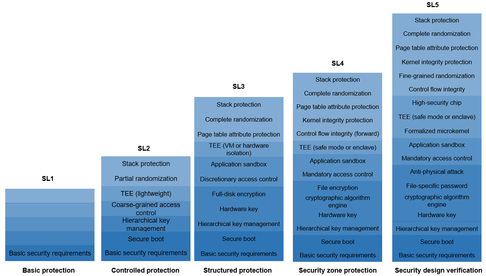

# Device Security Level Management


## Introduction

The OpenHarmony distributed technology can converge resources from different devices to form a Super Device. Poor security capabilities of any device may threaten the security of the Super Device. The Device Security Level Management (DSLM) module is introduced to manage the security levels of OpenHarmony devices.

The security level of an OpenHarmony device depends on the system security capabilities of the device. The OpenHarmony system security capabilities are based on the root of trust (RoT) for boot, RoT for storage, and RoT for compute on the hardware. Security technologies and capabilities focus on device integrity protection, data confidentiality protection, and vulnerability defense.

The figure below shows the OpenHarmony security architecture.



The above figure shows the typical security architecture for a single device. The architecture may vary depending on the risk level as well as the software and hardware resources of the device. The security capabilities of OpenHarmony devices are classified into five levels from SL1 to SL5, based on the industry standard security classification model and actual OpenHarmony service scenarios and device types. In the OpenHarmony ecosystem, higher security levels include all the capabilities of lower security levels by default. The figure below shows the security levels of OpenHarmony devices.



- SL1: SL1 is the lowest security level of OpenHarmony devices. Usually equipped with a lightweight operating system and low-end microprocessors, such devices implement simple services and do not need to process sensitive data. SL1 devices are required to support software integrity protection and eliminate common errors. Devices that cannot meet the requirements of SL1 can only be controlled by OpenHarmony devices. They cannot control OpenHarmony devices for more complex service collaboration.

- SL2: OpenHarmony devices of SL2 can label their own data and define access control rules to implement discretionary access control (DAC). These devices must have basic anti-penetration capabilities. Devices of this level support a lightweight, secure, and isolated environment for deploying a small number of necessary security services.

- OpenHarmony devices of SL3 have comprehensive security protection capabilities, and their operating systems have relatively complete security semantics and support mandatory access control (MAC). The system data can be structured as critical elements and non-critical elements. The critical elements are protected by a well-defined security policy model. Devices of this level must have certain anti-penetration capabilities to defend against common vulnerability exploits.

- SL4: OpenHarmony devices of SL4 must have simplified trusted computing base (TCB) and come with anti-tampering capabilities. The implementation of SL4 should be concise and secure enough. Adequate authentication and arbitration are required for any access to critical elements. Devices of this level have considerable anti-penetration capabilities and can defend against most software attacks.

- SL5: SL5 indicates the highest security protection capabilities for OpenHarmony devices. The system core software modules must have passed formal verification. Key hardware modules, such as the RoT and cryptographic computing engine, must be able to defend against physical attacks and attacks simulated in labs. Devices at this level must have high-security units, such as dedicated security chips, to enhance the boot, storage, and running of the root of trust (RoT).

The security level of each device in a Super Device provides the decision-making criteria for processing or hopping various user data.

For details about the relationship between data risk levels and device security levels, see [Data Transfer Management](https://gitee.com/openharmony/security_dataclassification).

## Directory Structure

The directory structure of the DSLM module is as follows:

```undefined
base/security/device_security_level
├── baselib        # Base library
├── common         # Common header files
├── interfaces     # Inner APIs
├── oem_property   # OEM adaptation
├── profile        # Component profiles
├── services       # Service framework code
└── test           # Test code
```

## Constraints

- Only C and C++ are supported.
- The default security level of OpenHarmony devices is SL1. Device vendors can [customize](https://gitee.com/openharmony/docs/blob/master/en/device-dev/subsystems/subsys-security-devicesecuritylevel.md#customizing-device-security-levels) a higher security level as required.

## Description

### Available APIs

When different types of user data are hopped or processed in OpenHarmony distributed devices, the DSLM APIs can be called to obtain the security levels of related devices for subsequent processing.

| API                                                                                                                                      | Description                    |
| ----------------------------------------------------------------------------------------------------------------------------------------- | ---------------------- |
| int32_t RequestDeviceSecurityInfo(const DeviceIdentify \*identify, const RequestOption \*option, DeviceSecurityInfo **info);                | Requests the security level information of a device synchronously.|
| int32_t RequestDeviceSecurityInfoAsync(const DeviceIdentify \*identify, const RequestOption \*option, DeviceSecurityInfoCallback callback); | Requests the security level information of a device asynchronously.|
| void FreeDeviceSecurityInfo(DeviceSecurityInfo \*info);                                                                                    | Releases the device security level information.            |
| int32_t GetDeviceSecurityLevelValue(const DeviceSecurityInfo \*info, int32_t \*level);                                                      | Obtains the device security level from the security level information. |

### Usage

All the APIs are native C interfaces for implementing underlying capabilities and are not open to apps.

- Adding Dependencies

1. Add the dependencies for compilation.

    ```undefined
    external_deps += [ "device_security_level:dslm_sdk" ]
    ```

2. Add the header files of dependencies.

    ```cpp
    #include "device_security_defines.h" // Header file for defining critical data structures.
    #include "device_security_info.h" // Header file for defining APIs.
    ```

- Example

The following is an example of synchronously obtaining the device security level:

```cpp
void CheckDestDeviceSecurityLevel(const DeviceIdentify *device, RequestOption *option)
{
    // Pointer to the device security level information.
    DeviceSecurityInfo *info = NULL;

    // Obtain the security level information of the device.
    int32_t ret = RequestDeviceSecurityInfo(device, option, &info);
    if (ret != SUCCESS) {
        // Failed to obtain the information. You can develop a retry process as required.
        return;
    }
    int32_t level = 0;
    // Obtain the device security level from the security level information.
    ret = GetDeviceSecurityLevelValue(info, &level);
    if (ret != SUCCESS) {
        // Failed to obtain the device security level. You can develop a retry process as required.
        FreeDeviceSecurityInfo(info);
        return;
    }

    // After the device security level is successfully obtained, check the lowest security level required for the current operation.
    // The lowest device security level required for the current operation is 3.
    if (level >= 3) {
        // The security level of the target device meets the requirements. Services are processed properly. 
    } else {
        // The security level of the target device does not meet the requirements. A toast or dialog box is displayed as required.
    }

    // Release the memory before the processing is complete.
    FreeDeviceSecurityInfo(info);
}
```

The following is an example of asynchronously obtaining the device security level:

```cpp
// Callback
void DeviceSecurityInfoCallback(const DeviceIdentify *identify, struct DeviceSecurityInfo *info)
{
    int32_t level = 0;
    // Obtain the device security level from the security level information.
    int32_t ret = GetDeviceSecurityLevelValue(info, &level);
    if (ret != SUCCESS) {
        // Failed to obtain the information. You can develop a retry process as required.
        FreeDeviceSecurityInfo(info);
        return;
    }

    // After the device security level is successfully obtained, check the lowest security level required for the current operation.
    // The lowest device security level required for the current operation is 3.
    if (level >= 3) {
        // The security level of the target device meets the requirements. Services are processed properly. 
    } else {
        // The security level of the target device does not meet the requirements. A toast or dialog box is displayed as required.
    }

    // Release the memory before the processing is complete.
    FreeDeviceSecurityInfo(info);
}

void CheckDestDeviceSecurityLevelAsync(const DeviceIdentify *device, RequestOption *option)
{
    // Invoke the asynchronous callback to return the device security level obtained.
    int ret = RequestDeviceSecurityInfoAsync(device, option, DeviceSecurityInfoCallback);
    if (ret != SUCCESS) {
        // Failed to obtain the device security level. You can develop a retry process as required.
        // In this case, the callback will not be invoked.
        return;
    }
    // The callback is invoked. Wait for the callback to return the device security level.
}
```

## Change Log

- V 1.0

## Repositories Involved

[Data Transfer Management](https://gitee.com/openharmony/security_dataclassification)

[**Device Security Level Management**](https://gitee.com/openharmony/security_device_security_level)

[HUKS](https://gitee.com/openharmony/security_huks)

[Application Permission Management](https://gitee.com/openharmony/security_permission)

[Device Authentication](https://gitee.com/openharmony/security_device_auth)

[SELinux](https://gitee.com/openharmony/security_selinux)
