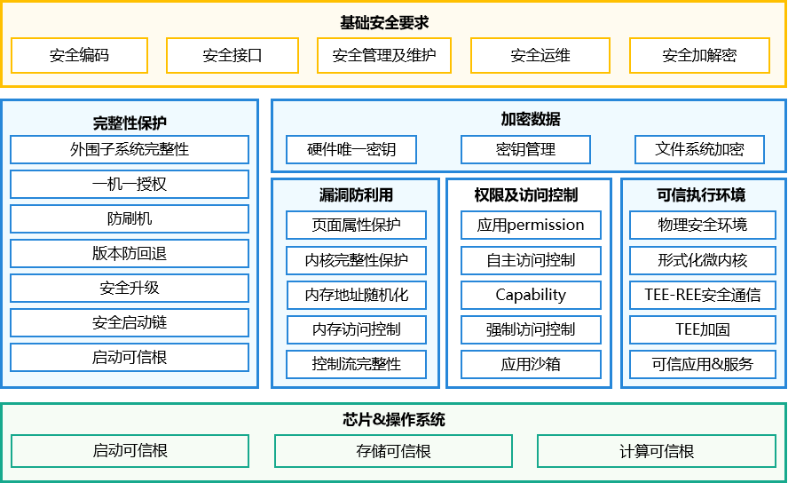
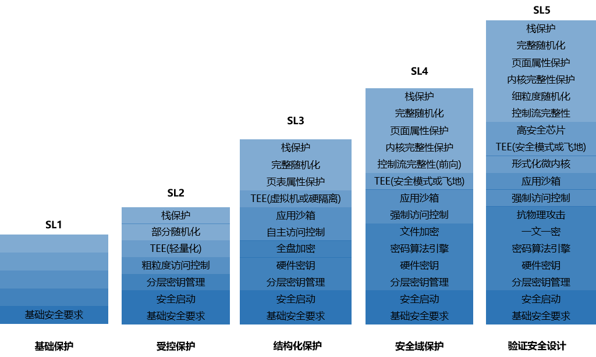

# 设备安全等级管理

- [设备安全等级管理](#设备安全等级管理)
  - [简介](#简介)
  - [目录](#目录)
  - [约束](#约束)
  - [说明](#说明)
    - [接口说明](#接口说明)
    - [使用说明](#使用说明)
  - [Changelog](#changelog)
  - [相关仓](#相关仓)

## 简介

OpenHarmony的分布式技术可以实现不同设备的资源融合，将多个设备虚拟成一个“超级虚拟终端”。在这个“超级虚拟终端”的内部，处理、流转各类用户数据时，需要确保各个节点不因安全能力薄弱，成为整个“超级虚拟终端”的薄弱点，因此引入设备安全等级管理模块来解决这类问题。

OpenHarmony设备的安全等级取决于设备的系统安全能力。OpenHarmony系统安全能力，根植于硬件实现的三个可信根：启动、存储、计算。基于基础安全工程能力，重点围绕以下三点构建相关的安全技术和能力：设备完整性保护、数据机密性保护、漏洞攻防对抗。

OpenHarmony系统安全架构如下图所示：



上图为典型的OpenHarmony单设备系统安全架构，在不同种类OpenHarmony设备上的实现可以存在差异，取决于设备的威胁分析（风险高低）和设备的软硬件资源。OpenHarmony在参考业界权威的安全分级模型基础上，结合OpenHarmony实际的业务场景和设备分类，将OpenHarmony设备的安全能力划分为 5 个安全等级：SL1 ~ SL5。OpenHarmony操作系统生态体系中，要求高一级的设备安全能力默认包含低一级的设备安全能力。分级概要可参考下图：



- SL1为OpenHarmony设备中最低的安全等级。这类设备通常搭载轻量级系统和使用低端微处理器，业务形态较为单一，不涉及敏感数据的处理。本安全等级要求消除常见的错误，支持软件的完整性保护。若无法满足本等级的要求，则只能作为配件受OpenHarmony设备操控，无法反向操控OpenHarmony设备并进行更复杂的业务协同。

- SL2安全等级的OpenHarmony设备，可对自身数据进行标记并定义访问控制规则，实现自主的访问控制，需要具备基础的抗渗透能力。此级别设备可支持轻量化的可安全隔离环境，用于部署少量必需的安全业务。

- SL3安全等级的OpenHarmony设备，具备较为完善的安全保护能力。其操作系统具有较为完善的安全语义，可支持强制访问控制。系统可结构化为关键保护元素和非关键保护元素，其关键保护元素被明确定义的安全策略模型保护。此级别设备应具备一定的抗渗透能力，可对抗常见的漏洞利用方法。

- SL4安全等级的OpenHarmony设备，可信基应保持足够的精简，具备防篡改的能力。SL4的实现应足够精简和安全，可对关键保护元素的访问控制进行充分的鉴定和仲裁。此级别设备具备相当的抗渗透能力，可抑制绝大多数软件攻击。

- SL5安全等级的OpenHarmony设备，为OpenHarmony设备中具备最高等级安全防护能力的设备。系统核心软件模块应进行形式化验证。关键硬件模块如可信根、密码计算引擎等应具备防物理攻击能力，可应对实验室级别的攻击。此级别设备应具备高安全单元，如专用的安全芯片，用于强化设备的启动可信根、存储可信根、运行可信根。

当“超级虚拟终端”内的各个设备有了自己的“设备安全等级”，这个“超级虚拟终端”的内部，各类用户数据的处理或流转便有了决策依据。

关于数据风险等级和设备安全等级之间的关系，可参考[数据分级保护](https://gitee.com/openharmony/security_dataclassification)。

## 目录

设备安全等级管理模块的代码目录结构如下：

```undefined
base/security/device_security_level
├── baselib        # 基础库
├── common         # 公共头文件
├── interfaces     # inner api接口
├── oem_property   # OEM厂家适配层
├── profile        # 组件配置文件
├── services       # 服务框架代码
└── test           # 测试代码
```

## 约束

- 开发语言：C/C++
- OpenHarmony设备的默认安全等级为SL1，设备制造商可以根据设备实际情况[定制](https://gitee.com/openharmony/docs/tree/master/zh-cn/device-dev/subsystems/subsys-security-devicesecuritylevel.md#%E8%AE%BE%E5%A4%87%E5%AE%89%E5%85%A8%E7%AD%89%E7%BA%A7%E5%AE%9A%E5%88%B6)更高的安全等级。

## 说明

### 接口说明

各子系统在处理、流转各类用户数据时，可以调用“设备安全等级管理”模块提供的下列接口，获取相关设备的安全等级信息。

| 接口名                                                                                                                                       | 说明                     |
| ----------------------------------------------------------------------------------------------------------------------------------------- | ---------------------- |
| int32_t RequestDeviceSecurityInfo(const DeviceIdentify \*identify, const RequestOption \*option, DeviceSecurityInfo **info);                | 请求获取某设备的设备安全等级信息（同步接口） |
| int32_t RequestDeviceSecurityInfoAsync(const DeviceIdentify \*identify, const RequestOption \*option, DeviceSecurityInfoCallback callback); | 请求获取某设备的设备安全等级信息（异步接口） |
| void FreeDeviceSecurityInfo(DeviceSecurityInfo \*info);                                                                                    | 释放设备安全等级信息             |
| int32_t GetDeviceSecurityLevelValue(const DeviceSecurityInfo \*info, int32_t \*level);                                                      | 从设备安全等级信息中提取对应的设备安全等级  |

### 使用说明

所有接口均为native C内部接口，仅提供底层能力，不对App开放。

- 依赖添加

1. 编译依赖添加

    ```undefined
    external_deps += [ "device_security_level:dslm_sdk" ]
    ```

2. 头文件依赖添加

    ```cpp
    #include "device_security_defines.h" // 关键数据结构定义头文件
    #include "device_security_info.h"    // 接口函数定义头文件
    ```

- 接口使用示例

1. 同步接口使用示例如下：

    ```cpp
    void CheckDestDeviceSecurityLevel(const DeviceIdentify *device, RequestOption *option)
    {
        // 设备安全等级信息指针
        DeviceSecurityInfo *info = NULL;

        // 调用同步接口获取设备的安全等级等级信息
        int32_t ret = RequestDeviceSecurityInfo(device, option, &info);
        if (ret != SUCCESS) {
            // 获取信息失败。此场景建议开发者根据实际情况进行重试
            return;
        }
        int32_t level = 0;
        // 从设备安全等级信息中提取设备安全等级字段
        ret = GetDeviceSecurityLevelValue(info, &level);
        if (ret != SUCCESS) {
            // 提取信息失败， 此场景建议开发者根据实际情况进行重试
            FreeDeviceSecurityInfo(info);
            return;
        }

        // 成功获取到设备安全等级，确认当前操作允许的最低安全等级
        // 假设当前操作允许的最低设备安全等级为3
        if (level >= 3) {
            // 目标设备的设备安全等级满足要求, 相关业务正常处理
        } else {
            // 目标设备的设备安全等级不满足要求, 建议开发者结合实际业务场景进行相应处理，例如告警、弹窗提示用户等
        }

        // 结束处理前，需要释放内存
        FreeDeviceSecurityInfo(info);
    }
    ```

2. 异步接口使用示例如下：

    ```cpp
    // 回调函数
    void DeviceSecurityInfoCallback(const DeviceIdentify *identify, struct DeviceSecurityInfo *info)
    {
        int32_t level = 0;
        // 从设备安全等级信息中提取设备安全等级字段
        int32_t ret = GetDeviceSecurityLevelValue(info, &level);
        if (ret != SUCCESS) {
            // 获取信息失败。此场景建议开发者根据实际情况进行重试
            FreeDeviceSecurityInfo(info);
            return;
        }

        // 成功获取到设备安全等级，确认当前操作允许的最低安全等级
        // 假设当前操作允许的最低设备安全等级为3
        if (level >= 3) {
            // 目标设备的设备安全等级满足要求, 相关业务正常处理
        } else {
            // 目标设备的设备安全等级不满足要求, 建议开发者结合实际业务场景进行相应处理，例如告警、弹窗提示用户等
        }

        // 结束处理前，需要释放内存
        FreeDeviceSecurityInfo(info);
    }

    void CheckDestDeviceSecurityLevelAsync(const DeviceIdentify *device, RequestOption *option)
    {
        // 调用异步接口获取设备设备的安全等级等级信息
        int ret = RequestDeviceSecurityInfoAsync(device, option, DeviceSecurityInfoCallback);
        if (ret != SUCCESS) {
            // 获取信息失败，此场景建议开发者根据实际情况进行重试
            // 此场景下callback不会回调。
            return;
        }
        // 调用成功，等待callback回调。
    }
    ```

## Changelog

- V1.0 首次提交

## 相关仓

[数据分级保护](https://gitee.com/openharmony/security_dataclassification)

[**设备安全等级管理**](https://gitee.com/openharmony/security_device_security_level/)

[HUKS](https://gitee.com/openharmony/security_huks)

[应用权限管理](https://gitee.com/openharmony/security_permission)

[设备认证](https://gitee.com/openharmony/security_device_auth)

[SELinux](https://gitee.com/openharmony/security_selinux)
