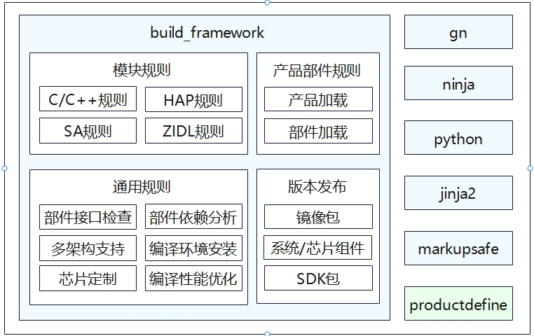

# 编译构建<a name="ZH-CN_TOPIC_0000001124588563"></a>

-   [简介](#section11660541593)
-   [目录](#section161941989596)
-   [约束与限制](#section2029921310472)
-   [说明](#section1312121216216)
-   [常见问题说明](#section131336181)
-   [相关仓](#section1371113476307)

## 简介<a name="section11660541593"></a>

编译构建子系统提供了一个基于Gn和ninja的编译构建框架。

根据产品配置，编译生成对应的镜像包。其中编译构建流程为：

1.  使用Gn配置构建目标。
2.  Gn运行后会生成ninja文件。
3.  通过运行ninja来执行编译任务。

**图 1**  编译构建子系统架构图<a name="fig16488143010409"></a>  


## 目录<a name="section161941989596"></a>

```
/build                           # 编译构建主目录

├── __pycache__                   
├── build_scripts/                # 编译相关的python脚本
├── common/                       
├── config/                       # 编译相关的配置项
├── core
│   ├── gn/                       # 编译入口BUILD.gn配置
│   └── build_scripts/            
├── docs                          
├── gn_helpers.py*                
├── lite/                         # hb和preloader入口                      
├── misc/                         
├── ohos                          # OpenHarmony编译打包流程配置
│   ├── kits                      # kits编译打包模板和处理流程
│   ├── ndk                       # ndk模板和处理流程
│   ├── notice                    # notice模板和处理流程
│   ├── packages                  # 版本打包模板和处理流程
│   ├── sa_profile                # sa模板和处理流程
│   ├── sdk                       # sdk模板和处理流程，包括sdk中包含的模块配置
│   └── testfwk                   # 测试相关的处理
├── ohos.gni*                     # 汇总了常用的gni文件，方便各个模块一次性import
├── ohos_system.prop              
├── ohos_var.gni*                 
├── prebuilts_download.sh*        # 预编译脚本
├── print_python_deps.py*         
├── scripts/                      
├── subsystem_config.json         
├── subsystem_config_example.json 
├── templates/                    # c/c++编译模板定义
├── test.gni*                     
├── toolchain                     # 编译工具链配置
├── tools                         # 常用工具
├── version.gni                   
├── zip.py*                       
```

## 约束与限制<a name="section2029921310472"></a>

-   编译环境需要Ubuntu18.04及以上版本。

-   安装编译所需的程序包。

    安装命令：

    ```
    sudo apt-get install bison ccache default-jdk flex gcc-arm-linux-gnueabi gcc-arm-none-eabi  genext2fs liblz4-tool libssl-dev libtinfo5 mtd-utils mtools openssl ruby scons unzip u-boot-tools  zip
    ```
    


## 说明<a name="section1312121216216"></a>

**代码根目录下执行全量版本的编译命令**

    ```
    ./build.sh --product-name {product_name}
    ```

    编译结果镜像输出在 out/${device_name}/packages/phone/images/目录下。

**编译命令支持选项**

    ```
    -h, --help                                        # 显示帮助信息并退出
    --source-root-dir=SOURCE_ROOT_DIR                 # 指定路径
    --product-name=PRODUCT_NAME                       # 指定产品名
    --device-name=DEVICE_NAME                         # 指定装置名称
    --target-cpu=TARGET_CPU                           # 指定cpu
    --target-os=TARGET_OS                             # 指定操作系统
    -T BUILD_TARGET, --build-target=BUILD_TARGET      # 指定编译目标，可以指定多个
    --gn-args=GN_ARGS                                 # gn参数，支持指定多个
    --ninja-args=NINJA_ARGS                           # ninja参数，支持指定多个
    -v, --verbose                                     # 生成时显示所有命令行
    --keep-ninja-going                                # 让ninja持续到1000000个工作失败
    --jobs=JOBS                                       # 指定编译线程数
    --export-para=EXPORT_PARA
    --build-only-gn                                   # 只做gn解析，不运行ninja
    --ccache                                          # 可选  编译使用ccache，需要本地安装ccache
    --fast-rebuild                                    # 快速重建，default=False
    --log-level=LOG_LEVEL                             # 指定编译期间的日志级别'，'三个级别可选：debug, info and error，default='info'
    --device-type=DEVICE_TYPE                         # 指定设备类型，default='default'
    --build-variant=BUILD_VARIANT                     # 指定设备操作模式，default='user'
    ```

**配置文件说明**

OpenHarmony的配置文件主要有四个。

1.  每个模块对应的BUILD.gn文件。
    可以使用提供的模板，也可以使用gn语法规则自定义编写。
    
    **例子：**

    _ohos\_shared\_library示例：_

    ```
    import("//build/ohos.gni")
    ohos_shared_library("helloworld") {
      sources = []
      include_dirs = []
      cflags = []
      cflags_c = []
      cflags_cc = []
      ldflags = []
      configs = []
      deps =[]  # 部件内模块依赖
    
      # 跨部件模块依赖定义，
      # 定义格式为 "部件名:模块名称"
      # 这里依赖的模块必须是依赖的部件声明在inner_kits中的模块
      external_deps = [
        "part_name:module_name",
      ]
    
      output_name = ""           # 可选，模块输出名
      output_extension = ""      # 可选，模块名后缀
      module_install_dir = ""    # 可选，缺省在/system/lib64或/system/lib下， 模块安装路径，模块安装路径，从system/，vendor/后开始指定
      relative_install_dir = ""  # 可选，模块安装相对路径，相对于/system/lib64或/system/lib；如果有module_install_dir配置时，该配置不生效
      install_images = []        # 可选，缺省值system，指定模块安装到那个分区镜像中，可以指定多个
    
      part_name = "" # 必选，所属部件名称
    }
    ```

    _ohos\_executable示例：_

    ohos\_executable模板属性和ohos\_shared\_library基本一致

    _注意：可执行模块（即ohos\_executable模板定义的）默认是不安装的，如果要安装，需要指定install\_enable = true_

    _ohos\_prebuilt\_etc示例：_

    ```
    import("//build/ohos.gni")
    ohos_prebuilt_etc("etc_file") {
      source = "file"
      deps = []                 # 部件内模块依赖
      module_install_dir = ""   #可选，模块安装路径，从system/，vendor/后开始指定
      relative_install_dir = "" #可选，模块安装相对路径，相对于system/etc；如果有module_install_dir配置时，该配置不生效
      install_images = []       # 可选，缺省值system，指定模块安装到那个分区镜像中，可以指定多个
      part_name = ""            # 必选，所属部件名称
    }
    ```
    更多详细的模板信息请参照[模块配置规则](https://gitee.com/openharmony/docs/tree/master/zh-cn/device-dev/subsystems/subsys-build-module.md#模块配置规则)。

2. 子系统中bundle.json文件或者ohos.build(看子系统具体支持哪一个，后续将全部用bundle.json)
    
    **bundle.json**

    ```
    {
       "name": "@ohos/<component_name>",                 # HPM部件英文名称，格式"@组织/部件名称"
       "description": "xxxxxxxxxxxxxxxxxxx",             # 部件功能一句话描述
       "version": "3.1",                                 # 版本号，版本号与OpenHarmony版本号一致
       "license": "MIT",                                 # 部件License
       "publishAs": "code-segment",                      # HPM包的发布方式，当前默认都为code_segment
       "segment": {
           "destPath": ""
       },                                                # 发布类型为code_segment时为必填项，定义发布类型code_segment的代码还原路径（源码路径）
       "dirs": {},                                       # HPM包的目录结构，字段必填内容可以留空
       "scripts": {},                                    # HPM包定义需要执行的脚本，字段必填，值非必填
       "licensePath": "COPYING",
       "readmePath": {
           "en": "README.rst"
       },
       "component": {                                    # 部件属性
           "name": "<component_name>",                   # 部件名称
           "subsystem": "",                              # 部件所属子系统
           "syscap": [],                                 # 部件为应用提供的系统能力
           "features": [],                               # 部件对外的可配置特性列表，一般与build中的sub_component对应，可供产品配置
           "adapted_system_type": [],                    # 轻量(mini)小型(small)和标准(standard)，可以是多个
           "rom": "xxxKB"                                # ROM基线，没有基线写当前值
           "ram": "xxxKB",                               # RAM基线，没有基线写当前值
           "deps": {
               "components": [],                         # 部件依赖的其他部件
               "third_party": []                         # 部件依赖的三方开源软件
           },
           "build": {                                    # 编译相关配置
               "sub_component": ["部件包含模块的gn目标"],  # 部件编译入口，新增模块在此处配置
               "inner_kits": [],                         # 部件间接口
               "test": []                                # 部件测试用例编译入口
           }
       }
    }
    ```
    bundle.json文件定义了子系统包含的部件。每个部件定义它所包含的模块目标component.build.sub_component，以及部件间交互的接口component.build.inner_kits，
    测试用例component.build.test_list。部件包含的 模块目标component.build.sub_component是必须要说明的。

    **ohos.build**
    ```
    {
    "parts": {
      "napi": {
        "module_list": [
          "//foundation/arkui/napi:napi_packages"              # 部件包含模块的gn目标
        ],
        "inner_kits": [                                        # 部件间接口
        ],
        "test_list": [                                         # 测试用例
          "//foundation/arkui/napi:napi_packages_test",
          "//foundation/arkui/napi/test/unittest:unittest"
        ]
      }

      "新增部件名": {
        "module_list": [
          "部件包含的gn目标"                                    # 部件包含模块的gn目标
        ],
        "inner_kits": [                                        # 部件间接口
        ],
        "test_list": [                                         # 测试用例
          "包含的测试用例",
        ]
      }
    }
    ......
    "subsystem": "ace",                                        # 所属子系统
    }
    ```
    ohos.build文件包含两个部分，subsystem部分说明了子系统的名称，parts部分定义了该子系统包含的部件，要添加一个部件，需要把该部件对应的内容添加进parts中去。添加的时候需要指明该部件包含的模块module_list，假如有提供给其它部件的接口，需要在inner_kits中说明，假如有测试用例，需要在test_list中说明，inner_kits与test_list没有也可以不添加。

    这两个文件均在对应的子系统根目录下，新增模块均在指定的目录下新增模块的gn目标即可，如果要新增一个部件，则需要在部件目录中新建一个bundle.json或者ohos.build，然后再在//vendor/{product_company}/{product-name}/config.json中添加对应的部件，直接添加到原有部件后即可。具体流程请参照编译构建指导的[配置规则](https://gitee.com/openharmony/docs/tree/master/zh-cn/device-dev/subsystems/subsys-build-all.md#配置规则)与[新增并编译不同配置](https://gitee.com/openharmony/docs/tree/master/zh-cn/device-dev/subsystems/subsys-build-all.md#新增并编译不同配置)，其中详细的介绍了如何添加一个模块、部件或者子系统。

    成功添加验证：
    - 在输出文件夹的对应子系统文件夹下的部件文件夹下的BUILD.gn文件中module_list包含了新建模块的BUILD.gn中定义的目标。
    - 编译完成后打包到image中去，生成对应的so文件或者二进制文件。


3. vendor\产品厂商\产品名\config.json

    ```
    {
      "product_name": "MyProduct",
      "version": "3.0",
      "type": "standard",
      "target_cpu": "arm",
      "ohos_version": "OpenHarmony 1.0",
      "device_company": "MyProductVendor",
      "board": "MySOC",
      "enable_ramdisk": true,
      "subsystems": [
        {
          "subsystem": "ace",
          "components": [
            { "component": "ace_engine_lite", "features":[""] }
          ]
        }，
        ...
      ]
    }
    ```
    指明了产品名，产品厂商，产品设备，版本，要编译的系统类型，以及产品包含的子系统。

4. build目录下的subsystem_config.json文件。

    ```
    {
      "arkui": {
       "path": "foundation/arkui",
       "name": "arkui"
      },
      "ai": {
       "path": "foundation/ai",
       "name": "ai"
      },
 	  ......
    }
    ```
    该文件对子系统进行了说明，我们需要该子系统定义中的name与path，分别表示子系统的名称和所在文件夹路径。

**ohos-sdk编译**

    **编译命令：**

    ``` ./build.sh --product-name ohos-sdk --ccache ```

    **结果输出：**

    ``` out/sdk/packages/ohos-sdk/ ```

    **ohos-sdk模块配置：**

    ``` build/ohos/sdk/ohos_sdk_description_std.json ```


## 常见问题说明<a name="section131336181"></a>

**如何将一个模块编译并打包到版本中？**

-   模块要指定part\_name，指定它归属的部件，一个模块只能属于一个部件；
-   部件的模块，要在部件配置的module\_list中，或者可以被module\_list中的模块依赖到；
-   部件要加到对应产品的部件列表中；

[FAQ](docs/FAQ.md)

[关于deps和external_deps的使用](docs/关于deps及external_deps的使用.md)

[标准系统如何添加一个模板并参与编译](docs/标准系统如何添加一个模块.md)

[标准系统如何修改镜像文件的打包参数](docs/标准系统如何修改镜像文件的打包参数.md)

[如何跟随系统使用gn编译hap](docs/how-to-build-a-hap.md)

[开源软件Notice收集策略说明](docs/开源软件Notice收集策略说明.md)

[关于生成开源软件包](docs/生成开源软件包.md)

[构建系统编码规范与最佳实践](https://gitee.com/openharmony/docs/blob/master/zh-cn/device-dev/subsystems/subsys-build-gn-coding-style-and-best-practice.md)

[部件化编译最佳实践](docs/部件化编译最佳实践.md)


## 相关仓<a name="section1371113476307"></a>

**[编译构建子系统](https://gitee.com/openharmony/docs/blob/master/zh-cn/readme/编译构建子系统.md)**

**[build\_lite](https://gitee.com/openharmony/build_lite/blob/master/README_zh.md)**

