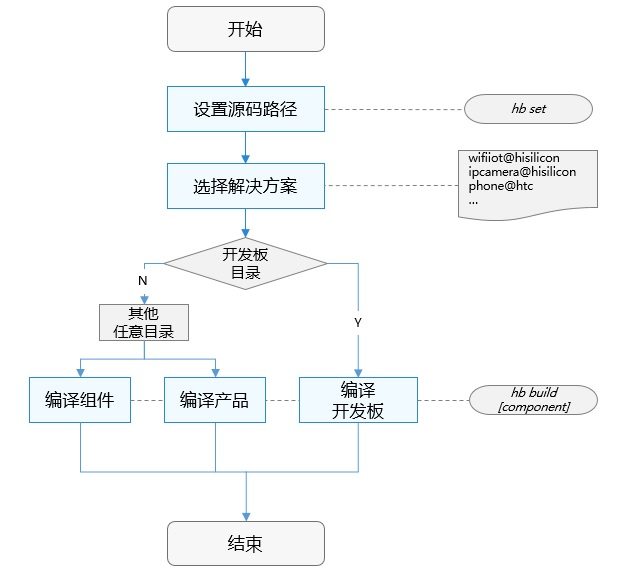

# 轻量级编译构建组件<a name="ZH-CN_TOPIC_0000001130006475"></a>

-   [简介](#section11660541593)
-   [目录](#section161941989596)
-   [说明](#section1312121216216)
    -   [使用说明](#section129654513264)

-   [相关仓](#section1371113476307)

## 简介<a name="section11660541593"></a>

一个基于gn和ninja的支持OpenHarmony组件化开发的编译框架，主要提供以下功能：

-   构建产品。

-   独立构建芯片厂商组件。
-   独立构建单个组件。

在开发编译构建前，应了解如下基本概念：

-   组件

    可复用的软件单元，它可包含源码、配置文件、资源文件和编译脚本等。

-   gn

    Generate ninja的缩写，一种元构建系统，用于产生ninja文件。

-   ninja

    ninja是一个专注于速度的小型构建系统。


构建流程如下：

编译构建流程如图1所示，主要包括设置和编译两步：

**图 1**  编译构建流程<a name="fig1531311552204"></a>  


1.  hb set: 设置OpenHarmony源码目录和要编译的产品。
2.  hb build: 编译产品、开发板或者组件。解决方案编译实现如下：
    -   读取开发板配置：主要包括开发板使用的编译工具链、编译链接命令和选项等。
    -   调用gn: 调用gn gen命令，读取产品配置\(主要包括开发板、内核、选择的组件等\)生成解决方案out目录和ninja文件。
    -   调用ninja：调用ninja -C out/company/product启动编译。
    -   系统镜像打包：将组件编译产物打包，制作文件系统镜像。


## 目录<a name="section161941989596"></a>

```
build/lite                      # 编译构建主目录
├── components                  # 组件描述文件。
├── hb                          # hb pip安装包源码。
├── make_rootfs                 # 文件系统制作脚本。
├── config                      # 编译相关的配置项
│   ├── component               # 组件相关的模板定义。包括：静态库、动态库、扩展组件、模拟器库等
│   ├── kernel                  # 内核的编译配置参数
│   └── subsystem               # 子系统模板
├── ndk                         # Native API相关编译脚本与配置参数
└── toolchain                   # 编译工具链相关，包括：编译器路径、编译选项、链接选项等。
```

## 说明<a name="section1312121216216"></a>

### 使用说明<a name="section129654513264"></a>

1.  **前提条件**
    -   Linux服务器，Ubuntu16.04及以上64位系统版本。
    -   Python 3.7.4及以上。
    -   OpenHarmony源码build\_lite仓下载成功。

2.  **安装hb**
    -   在源码根目录下执行：

        ```
        python3 -m pip install --user build/lite
        ```

    -   执行hb -h有相关帮助信息，有打印信息即表示安装成功：

        ```
        usage: hb
        
        OHOS build system
        
        positional arguments:
          {build,set,env,clean}
            build               Build source code
            set                 OHOS build settings
            env                 Show OHOS build env
            clean               Clean output
        
        optional arguments:
          -h, --help            show this help message and exit
        ```

    -   卸载方法：

        ```
        python3 -m pip uninstall ohos-build
        ```


3.  **编译命令**
    1.  **hb set**

        ```
        hb set -h
        usage: hb set [-h] [-root [ROOT_PATH]] [-p]
        
        optional arguments:
          -h, --help            Show this help message and exit.
          -root [ROOT_PATH], --root_path [ROOT_PATH]
                                Set OHOS root path.
          -p, --product         Set OHOS board and kernel.
        ```

        -   hb set 后无参数，进入默认设置流程
        -   hb set -root \[ROOT\_PATH\] 直接设置代码根目录
        -   hb set -p --product 设置要编译的产品

    2.  **hb env**

        查看当前设置信息

        ```
        hb env
        [OHOS INFO] root path: xxx
        [OHOS INFO] board: hispark_taurus
        [OHOS INFO] kernel: liteos
        [OHOS INFO] product: ipcamera
        [OHOS INFO] product path: xxx/vendor/hisilicon/ipcamera
        [OHOS INFO] device path: xxx/device/hisilicon/hispark_taurus/sdk_linux_4.19
        ```

    3.  **hb build**

        ```
        hb build -h
        usage: hb build [-h] [-b BUILD_TYPE] [-c COMPILER] [-t [TEST [TEST ...]]]
                        [--dmverity] [-p PRODUCT] [-f] [-n]
                        [component [component ...]]
        
        positional arguments:
          component             Name of the component.
        
        optional arguments:
          -h, --help            Show this help message and exit.
          -b BUILD_TYPE, --build_type BUILD_TYPE
                                Release or debug version.
          -c COMPILER, --compiler COMPILER
                                Specify compiler.
          -t [TEST [TEST ...]], --test [TEST [TEST ...]]
                                Compile test suit.
          --dmverity            Enable dmverity.
          -p PRODUCT, --product PRODUCT
                                Build a specified product with
                                {product_name}@{company}, eg: ipcamera@hisilcon.
          -f, --full            Full code compilation.
          -T [TARGET [TARGET ...]], --target [TARGET [TARGET ...]]
                                Compile single target
        ```

        -   hb build后无参数，会按照设置好的代码路径、产品进行编译，编译选项使用与之前保持一致。
        -   hb build component：基于设置好的产品对应的单板、内核，单独编译组件（e.g.：hb build kv\_store\)。
        -   hb build -p PRODUCT：免set编译产品，该命令可以跳过set步骤，直接编译产品。
        -   在device/device\_company/board下单独执行hb build会进入内核选择界面，选择完成后会根据当前路径的单板、选择的内核编译出仅包含内核、驱动的镜像。

    4.  **hb clean**

        清除out目录对应产品的编译产物，仅剩下args.gn、build.log。清除指定路径可输入路径参数：hb clean xxx/out/xxx，否则将清除hb set的产品对应out路径

        ```
        hb clean
        usage: hb clean [-h] [out_path]
        
        positional arguments:
          out_path    Clean a specified path.
        
        optional arguments:
          -h, --help  Show this help message and exit.
        ```


## 相关仓<a name="section1371113476307"></a>

**[编译构建子系统](https://gitee.com/openharmony/docs/blob/master/zh-cn/readme/编译构建子系统.md)**

**[build](https://gitee.com/openharmony/build/blob/master/README_zh.md)**