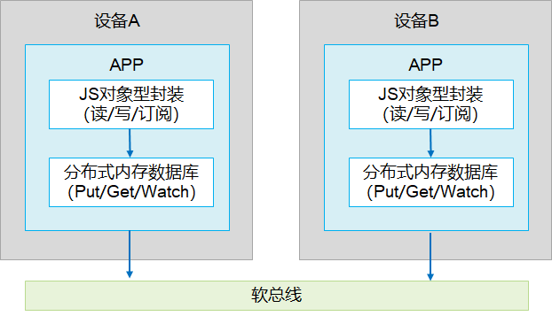

# 分布式数据对象部件
## 简介
分布式数据对象管理框架是一款面向对象的内存数据管理框架，向应用开发者提供内存对象的创建、查询、删除、修改、订阅等基本数据对象的管理能力，同时具备分布式能力，满足超级终端场景下，相同应用多设备间的数据对象协同需求。

分布式数据对象提供JS接口，让开发者能以使用本地对象的方式使用分布式对象。分布式数据对象支持的数据类型包括数字型、字符型、布尔型等基本类型，同时也支持数组、基本类型嵌套等复杂类型。

## 约束

•	不同设备间只有相同bundleName的应用才能直接同步

•	不建议创建过多分布式对象，每个分布式对象将占用100-150KB内存

•	每个对象大小不超过500KB

•	支持JS接口间的互通，与其他语言不互通

•	如对复杂类型的数据进行修改，仅支持修改根属性，暂不支持下级属性修改

## 目录

```
//foundation/distributeddatamgr/data_object/
├── frameworks            # 框架层代码
│   ├── innerkitsimpl     # 内部接口实现
│   │   ├── include
│   │   ├── src
│   │   └── test          # C++测试用例
│   └── jskitsimpl        # JS API实现
│       ├── include
│       ├── src
│       └── test          # js测试用例
├── interfaces            # 接口代码
│   ├── innerkits         # 内部接口声明
│   └── jskits            # js接口声明
├── picture               # 资源图库
└── samples               # 开发实例
```
**图 1**  分布式数据对象实现图<a name="fig1"></a>



每定义一个分布式数据对象都会创建一个分布式内存数据库，通过sessionId来标识。当对分布式数据对象进行读写操作时，实际上是对分布式数据库进行读写操作。分布式数据对象通过软总线实现数据的同步。
## 接口说明

### 引用分布式对象头文件

```js
import distributedObject from '@ohos.data.distributedDataObject'
```

### 接口

| 接口名称                                                     | 描述                                                         |
| ------------------------------------------------------------ | ------------------------------------------------------------ |
| function createDistributedObject(source: object): DistributedObject; | 创建分布式对象<br>source中指定分布式对象中的属性<br>返回值是创建出的分布式对象，接口见DistrubutedObject |
| function genSessionId(): string;                             | 随机创建sessionId<br>返回值是随机创建的sessionId             |

### DistrubutedObject

| 接口名称                                                     | 描述                                                         |
| ------------------------------------------------------------ | ------------------------------------------------------------ |
| setSessionId(sessionId?: string): boolean;                   | 设置同步的sessionId,可信组网中有多个设备时，多个设备间的对象如果设置为同一个sessionId,就能自动同步<br>sessionId是不同设备间组网的标识，将sessionId设置为" "或不设置均可退出组网<br>返回值是操作结果，true表示设置sessionId成功 |
| on(type: 'change', callback: Callback<{ sessionId: string, fields: Array<string> }>): void; | 监听对象数据的变更<br>type固定为'change'<br>callback是变更时触发的回调，回调参数sessionId标识变更对象的sessionId,fields标识对象变更的属性名 |
| off(type: 'change', callback?: Callback<{ sessionId: string, fields: Array<string> } | 删除数据对象变更的监听<br>type固定为'change'<br>callback为可选参数，不设置表示删除该对象所有变更监听 |
| on(type: 'status', callback: Callback<{ sessionId: string, networkId: string, status: 'online' \| 'offline' }>): void | 监听数据对象上下线的变更<br/>type固定为'status'<br/>callback是变更时触发的回调，回调参数sessionId标识变更对象的sessionId，networkId标识对象设备的networkId，status标识对象为'online'(上线)或'offline'(下线)的状态 |
| off(type: 'status', callback?: Callback<{ sessionId: string, deviceId: string, status: 'online' \| 'offline' }>): void | 删除数据对象上下线变更的监听<br/>type固定为'status'<br/>callback为可选参数，不设置表示删除该数据对象所有上下线监听 |
| save(deviceId: string, callback: AsyncCallback&lt;SaveSuccessResponse&gt;): void | 持久化保存数据对象<br/>deviceId为设备Id，用户自定义。例如"local"。<br/> |
| revokeSave(callback: AsyncCallback<RevokeSaveSuccessResponse>): void | 撤回已保存的数据对象。callback为撤回已保存的数据对象回调。


## 开发实例

针对分布式数据对象，有以下开发实例可供参考：

[备忘录应用](https://gitee.com/openharmony/distributeddatamgr_objectstore/tree/master/samples/distributedNotepad)

分布式数据对象在备忘录应用中，通过分布式数据对象框架，当用户在某一端设备上新增备忘录事件，修改编辑事件标题和内容以及清空事件列表时，产生的数据变更结果均可以同步刷新显现在可信组网内其他设备上。

## 相关仓
- [分布式数据对象开发指导](https://gitee.com/openharmony/docs/blob/master/zh-cn/application-dev/database/database-distributedobject-guidelines.md)
- [分布式数据对象API文档](https://gitee.com/openharmony/docs/blob/master/zh-cn/application-dev/reference/apis/js-apis-data-distributedobject.md)
- [distributeddatamgr\_datamgr](https://gitee.com/openharmony/distributeddatamgr_datamgr)
- [third\_party\_sqlite](https://gitee.com/openharmony/third_party_sqlite)
- **[distributeddatamgr\_data\_object](https://gitee.com/openharmony/distributeddatamgr_data_object)**
