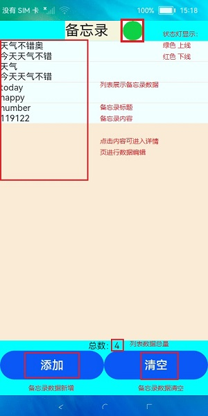

# Sample：使用分布式对象创建备忘录

 ## **分布式对象**

分布式数据对象管理框架，是一款面向对象的内存数据管理框架。本框架向应用开发者提供内存对象的创建、查询、删除、修改、订阅等基本数据对象的管理能力，同时具备分布式能力，能够满足在超级终端场景下，相同应用可在多台设备间进行数据对象协同的功能需求。 

 ## **备忘录应用**

在备忘录应用中，通过分布式数据对象框架，当用户在某一端设备上新增备忘录事件，修改编辑事件标题和内容以及清空事件列表时，产生的数据变更结果均可以同步刷新显现在可信组网内其他设备上。

• 应用首页效果图



• 应用软件监听分布式对象上下线状态显示，红色表示下线，绿色表示上线。

 

 

 ## **开发步骤**

分布式数据对象 要求多个设备在同一可信组网中。

 ### 1）导入模块

```js
// 导包-分布式数据对象接口
import distributedObject from '@ohos.data.distributedDataObject' 
```

 ### 2）创建一个 分布式数据对象类 DistributedDataModel，用于管理和操作分布式数据对象，以及数据存储；

```js
export default class DistributedDataModel {
	// 用来存储备忘录数据信息，作为分布式对象的documentList属性数据
    documentList = [];
	// 用来存储新建的分布式对象，该对象用来同步数据
    distributedObject; 
	// 下线显示灯状态图标
    imgSrc = "common/red.png"; 
 	// 用来存储分布式对象的数据变更监听
    #callback; 
    // 用来存储分布式对象的上下线的状态变更监听
    #statusCallback; 
    
    constructor() {
		// 创建分布式对象，同时指定分布式对象的属性documentList 和 documentSize 
		// 表示该分布式对象可以同步属性documentList 和 documentSize 
		// 返回创建出的分布式对象distributedObject
		this.distributedObject = distributedObject.createDistributedObject({
			documentList: this.documentList,
			documentSize: 0
		});
		// 初始化时,进行分布式对象的系统授权和组网通信。
		this.share(); 
	}
```

 ### 3）授权许可

分布式对象要实现数据同步必须要通过系统的授权许可。因此需要在项目的config.json文件中声明DATASYNC权限信息。

```
"reqPermissions": [
  {
    "name": "ohos.permission.DISTRIBUTED_DATASYNC"
  }
],
```

完成权限申明后，实现向系统请求权限操作。

```js
function grantPermission() {
	let context = featureAbility.getContext(); 
    // 向系统请求权限,用户弹框显示
    // 使用config文件中声明的DATASYNC权限
    // 请求代码可自定义，同时也可自定义异步回调函数
    context.requestPermissionsFromUser(['ohos.permission.DISTRIBUTED_DATASYNC'], 666, function (result) {
       ...
    })
}
```

 ### 4）设置同步的sessionId，进行多个设备的同步组网

将share函数置于在分布式数据对象类的构造函数中,因此当DistributedDataModel初始化时，应用程序会进行分布式对象的同步组网。

```js
share() {
	if (this.distributedObject.__sessionId == undefined) {
		// 申请系统授权许可
		grantPermission()
		// 加入同步组网
		// 设置同步的sessionId,可信组网中有多个设备时，多个设备间的对象需要置为同一个sessionId。
		this.distributedObject.setSessionId("123456") 
	} 
}
```

 ### 5）监听分布式对象的数据变更

```js
setCallback(callback) {
	... 
	// 删除对象的原始变更监听
	if (this.#callback != undefined) {
		this.distributedObject.off("change", this.#callback);
	}   
	this.#callback = callback;       
	// 监听对象的变更，其入参为 type和callback
	// type 是'change'时，表示数据修改监听
	// callback是变更时触发的回调，callback入参为sessionId和changeData，sessionId标识变更对象，changeData为对象变更的属性
	this.distributedObject.on("change", this.#callback);
}
```

 ### 6）监听分布式对象的上下线的状态变更

```js
setStatusCallback(callback) {
	if (this.#statusCallback == callback) {
		return;
	}
	if (this.#statusCallback != undefined) {
		// 删除对象的原始上下线监听
		this.distributedObject.off("status", this.#statusCallback);
	}
	this.#statusCallback = callback;
	// 监听对象状态的变更，其入参为 type和callback
	// type 是'status'时，表示上下先状态更改监听
	// callback是变更时触发的回调，其回调参数sessionId标识变更对象的sessionId，networkId标识对象设备的networkId，status标识对象为'online'(上线)或'offline'(下线)的状态
	this.distributedObject.on("status", this.#statusCallback);
}
```

 ## **应用示例**

• 在应用首页，详情页面 和新增页面对应的js文件中导入创建的分布式对象类。

```js
import * as distr from '../../../model/DistributedDataModel.js'
```

• 对端修改数据时，changeCallback回调触发，依据变更数据changeData和设备组网同步的SessionId ，刷新界面。

```js
changeCallback(sessionId, changeData) {
	changeData.forEach(element => {
		if (element == "documentList") {
			// 刷新界面上的备忘录数据列表
			this.dataModel.documentList = distr.g_dataModel.distributedObject.documentList;
		}
		else if (element == "documentSize") {
			let size = distr.g_dataModel.distributedObject.documentSize;
			// 刷新界面上列表总数
			this.dataModel.distributedObject.documentSize = size;
		}
	});
 }
```

- 在页面初始化函数中设定监听分布式对象上下线状态回调，进行设备组网检测，并亮灯提示。
- 在页面初始化函数中设定监听分布式对象的数据变更回调，监听对端设备的数据变更。

```js
onInit() {
	// 监听对端设备的数据变更
	// 发起方要在changeCallback里刷新界面，则需要将正确的this绑定给changeCallback
	distr.g_dataModel.setCallback(this.changeCallback.bind(this));
	// 监听分布式对象的上下线状态
	distr.g_dataModel.setStatusCallback((sessionId, networkId, status) => {  
	// 刷新红绿灯界面
		if (status == "online") {
			this.dataModel.imgSrc = "common/green.png";
		} 
		else {
			this.dataModel.imgSrc = "common/red.png";
		}
	})
 }
```

 ## **应用场景**

- 当用户进行“添加”数据操作时，获取页面的新添加的数据后，将其转存储于分布式对象的documentList属性中，并依据新的数据容量重新赋值documentSize属性。

```js
doAdd: function () {
	distr.g_dataModel.add(this.title, this.content);
	...
}
```

```js
add(title, content) {
    this.documentList = this.distributedObject.documentList; 
    this.documentList[this.distributedObject.documentSize] = {
        index: this.distributedObject.documentSize, title: title, content: content
    };
     // 分布式对象的数据变更会自动同步到组网内的可信设备
    this.distributedObject.documentList = this.documentList;
    this.distributedObject.documentSize ++;  
	}
```
- 当用户查看事件详情，并完成数据修改操作时，应用程序会将用户编辑的该条数据结果更新至分布式对象的documentList属性中。

```js
save: function () {
	// 使用页面数据更新分布式对象属性数据
	distr.g_dataModel.update(this.editIndex,  this.title, this.content);
	...
}
```

```js
update(index, title, content) {
	this.documentList[index] = {
		index: index, title: title, content: content
	};
	// 分布式对象的数据变更会自动同步到组网内的可信设备
	this.distributedObject.documentList = this.documentList;
}
```

- 当用户在应用首页执行“清空”数据操作时，应用程序则会对分布式对象的documentList和documentSize属性进行重新初始化处理。实现对分布式对象的属性数据更改。

```js
clear: function () {
	 // 触发界面刷新
	this.dataModel.documentList = [];
	distr.g_dataModel.clear();
	this.dataModel.distributedObject.documentSize = 0;
 },
```

```js
clear() {
	this.documentList = []; 
    // 分布式对象的数据变更会自动同步到组网内的可信设备
    this.distributedObject.documentList = this.documentList;  
    this.distributedObject.documentSize = 0; 
}
```