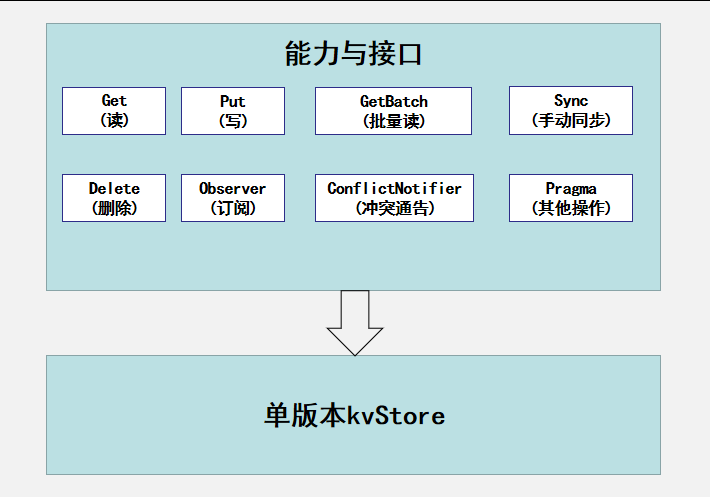

# KV数据库（KV store）

## 简介

**KV数据库（KV store）**
依托当前公共基础库提供的KV存储能力开发，为设备应用提供键值对数据管理能力。在有进程的平台上，KV存储提供的参数管理，供单进程访问不能被其他进程使用。在此类平台上，KV存储作为基础库加载在应用进程，以保障不被其他进程访问。

**图 1**  键值型数据库主要能力



## 目录

```
//foundation/distributeddatamgr/kv_store
├── frameworks            # 框架层代码
│   ├── common            # 公共工具类
│   ├── innerkitsimpl     # 部件间接口代码实现
│   ├── jskitsimpl        # JS API的实现
│   ├── libs              # DB代码实现
│   └── native            # 内部接口实现
├── interfaces            # 接口代码
│    ├── inner_api        # 内部接口声明
│    ├── innerkits        # 部件间接口声明
│    └── jskits           # JS API的声明
└── test                  # 测试用例资源
```
## 约束

- KV大小及可存储条目数在平台可承受内可修改配置，通过修改编译宏修改；

- 依赖平台具有正常的文件创建、读写删除修改、锁等能力，针对不同平台（如LiteOS-M内核、LiteOS-A内核等）尽可能表现接口语义功能的不变；

- 由于平台能力差异数据库能力需要做相应裁剪，其中不同平台内部实现可能不同；

- 对于指定路径仅支持创建数据库单例，不支持同一路径创建多数据库实例对象。

## 相关仓

- [分布式数据管理子系统](https://gitee.com/openharmony/docs/blob/master/zh-cn/readme/%E5%88%86%E5%B8%83%E5%BC%8F%E6%95%B0%E6%8D%AE%E7%AE%A1%E7%90%86%E5%AD%90%E7%B3%BB%E7%BB%9F.md)

- [**distributeddatamgr\_kv_store**](https://gitee.com/openharmony/distributeddatamgr_kv_store/blob/master/README_zh.md)

- [third\_party\_sqlite](https://gitee.com/openharmony/third_party_sqlite)