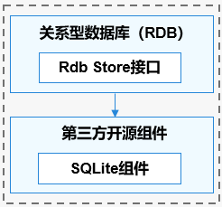

# 关系型数据库（Relational Database，RDB）

## 简介

**关系型数据库（Relational Database，RDB）** 是一种基于关系模型来管理数据的数据库。OpenHarmony关系型数据库基于SQLite组件提供了一套完整的对本地数据库进行管理的机制。
   
OpenHarmony关系型数据库底层使用SQLite作为持久化存储引擎，支持SQLite具有的所有数据库特性，包括但不限于事务、索引、视图、触发器、外键、参数化查询和预编译SQL语句。

以下是几个基本概念：
-   **关系型数据库**

    创建在关系模型基础上的数据库，以行和列的形式存储数据。

-   **结果集**

    指用户查询之后的结果集合，可以对数据进行访问。结果集提供了灵活的数据访问方式，可以更方便的拿到用户想要的数据。

-   **SQLite数据库**

    一款轻量级的数据库，是遵守ACID的关系型数据库组件。它是一个开源的项目。

**图 1**  关系型数据库运作机制




## 目录

```
//foundation/distributeddatamgr/relational_store/
├── frameworks            # 框架层代码
│   └── js                # JS API的实现
│   │   └── napi          # napi代码实现
│   └── native            # 内部接口实现
├── interfaces            # 接口代码
│   └── inner_api         # 内部接口声明
└── test                  # 测试用例
    ├── js                # js用例
    └── native            # C++用例
```

## 约束

数据库中连接池的最大数量是4个，用以管理用户的读写操作。

为保证数据的准确性，数据库同一时间只能支持一个写操作。

## 相关仓

- [分布式数据管理子系统](https://gitee.com/openharmony/docs/blob/master/zh-cn/readme/%E5%88%86%E5%B8%83%E5%BC%8F%E6%95%B0%E6%8D%AE%E7%AE%A1%E7%90%86%E5%AD%90%E7%B3%BB%E7%BB%9F.md)

- [**distributeddatamgr\_relational_store**](https://gitee.com/openharmony/distributeddatamgr_relational_store/blob/master/README_zh.md)

- [third\_party\_sqlite](https://gitee.com/openharmony/third_party_sqlite)