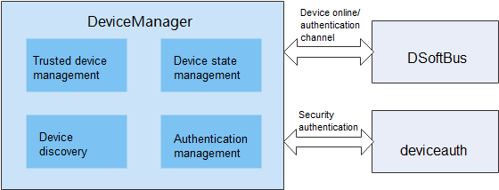

# **DeviceManager**

## Introduction

DeviceManager supports authentication and networking for account-independent distributed devices. It provides a set of APIs for listening, discovery, and authentication of distributed devices.

The figure below shows the architecture and dependencies of DeviceManager:



## Directory Structure

```
foundation/distributedhardware/device_manager
├── common                        # Header files of common capabilities
│   └── include
│       └── ipc
│           └── model             # Header files of the IPC function module
├── display                       # Display HAP code
│   └── entry
│       └── src
│           └── main
│               ├── js            # JS code for the PIN display ServiceExtensionAbility
│               └── resources     # Resource configuration files for PIN display ServiceExtensionAbility
├── figures
├── interfaces
│   ├── inner_kits                # Internal interfaces and their implementation
│   │   └── native_cpp            # Internal native interfaces and their implementation
│   │       ├── include
│   │       │   ├── ipc           # IPC header files
│   │       │   │   ├── lite      # Small system
│   │       │   │   └── standard  # Standard system
│   │       │   └── notify        # IPC callback header files
│   │       └── src
│   │           ├── ipc           # IPC core code
│   │           │   ├── lite      # Small system
│   │           │   └── standard  # Standard system
│   │           └── notify         IPC callback core code
│   └── kits                      # External interfaces and their implementation
│       └── js                    # External JS interfaces and their implementation
│           ├── include           # External JS interfaces and their implementation files
│           └── src               # External JS interface and their implementation code
├── sa_profile
├── services
│   └── devicemanagerservice      # devicemanagerservice core code
│       ├── include
│       │   ├── ability           # Header files related to PIN display ServiceExtensionAbility startup management
│       │   ├── auth              # Header files related to device authentication
│       │   ├── ipc               # IPC header files
│       │   │   ├── lite          # Small system
│       │   │   └── standard      # Standard system
│       │   ├── message           # Header files related to message parsing
│       │   ├── requestauth       # Header files related to device authentication
│       │   ├── softbus           # Header files related to DSoftBus
│       │   └── timer             # Header files related to timer processing
│       └── src
│           ├── ability           # Core code related to PIN display ServiceExtensionAbility startup management
│           │   ├── lite          # Small system
│           │   └── standard      # Standard system
│           ├── auth              # Core code related to device authentication
│           ├── ipc               # IPC core code
│           │   ├── lite          # Small system
│           │   └── standard      # Standard system
│           ├── message           # Core code for message parsing
│           ├── requestauth       # Core code for device authentication
│           ├── softbus           # Core code for DSoftBus
│           └── timer             # Core code for timer processing
└── utils                         # Header files of utils
    ├── include
    │   ├── cipher                # Header files related to encryption and decryption
    │   ├── ipc                   # IPC common header files
    │   │   ├── lite              # Small system
    │   │   └── standard          # Standard system
    │   └── log                   # Log-related header files
    └── src
        ├── cipher                # Core code of encryption and decryption
        ├── ipc                   # IPC common core code
        │   ├── lite              # Small system
        │   └── standard          # Standard system
        └── log                   # Log-related core code
```

## Constraints

- Programming languages: JS and C++
- Applicable devices: OpenHarmony devices such as the Hi3516D V300 development board


## Available APIs

Currently, DeviceManager does not support permission management. Its system APIs can be called only by system applications. In later versions, strict permission control will be implemented.
For details about the APIs, see *ohos.distributedHardware.deviceManager.d.ts* in [**interface_sdk-js repository**](https://gitee.com/openharmony/interface_sdk-js/).

- Public APIs

  Before using APIs in **DeviceManager**, call **createDeviceManager** to create a **DeviceManager** instance.

  If you no longer need to use the APIs, release the **DeviceManager** instance.

| Prototype                                                        | Description                           |
| ------------------------------------------------------------ | ------------------------------- |
| createDeviceManager(bundleName: string, callback: AsyncCallback<DeviceManager>): void; | Obtains a **DeviceManager** instance in asynchronous mode.|
| release(): void;                                             | Releases a **DeviceManager** instance.          |


- System APIs

  DeviceManager provides APIs related to trusted device list obtaining, device state listening, device discovery, and device authentication. These APIs are system APIs and can be invoked only by system applications.

  The APIs for starting and stopping device discovery must be used in pairs, with the same subscribe ID.

| Prototype                                                        | Description                |
| ------------------------------------------------------------ | -------------------- |
| getTrustedDeviceListSync(): Array<DeviceInfo>;                                                                                            | Obtains the trusted device list.|
| on(type: 'deviceStateChange', callback: Callback<{ action: DeviceStateChangeAction, device: DeviceInfo }>): void;                         | Subscribes to device state changes.|
| off(type: 'deviceStateChange', callback?: Callback<{ action: DeviceStateChangeAction, device: DeviceInfo }>): void;                       | Unsubscribes from device state changes.|
| on(type: 'serviceDie', callback: () => void): void;                                                                                       | Subscribes to device errors.|
| off(type: 'serviceDie', callback?: () => void): void;                                                                                     | Unsubscribes from service errors.|
| startDeviceDiscovery(subscribeInfo: SubscribeInfo): void;    | Starts device discovery.        |
| stopDeviceDiscovery(subscribeId: number): void;              | Stops device discovery.        |
| authenticateDevice(deviceInfo: DeviceInfo, authparam: AuthParam, callback: AsyncCallback<{deviceId: string, pinTone ?: number}>): void; | Authenticates a device.        |
| setUserOperation(operateAction: number, params: string): void;    | Set user ui operation behavior         |
| verifyAuthInfo(authInfo: AuthInfo, callback: AsyncCallback<{deviceId: string, level: number}>): void; | Verifies device authentication information.    |
| on(type: 'deviceFound', callback: Callback<{ subscribeId: number, device: DeviceInfo }>): void; | Subscribes to discovered device list changes.    |
| off(type: 'deviceFound', callback?: Callback<{ subscribeId: number, device: DeviceInfo }>): void; | Unsubscribes from discovered device list changes.|
| on(type: 'discoverFail', callback: Callback<{ subscribeId: number, reason: number }>): void; | Subscribes to device discovery failures.    |
| off(type: 'discoverFail', callback?: Callback<{ subscribeId: number, reason: number }>): void; | Unsubscribes from device discovery failures.|
| on(type: 'publishSuccess', callback: Callback<{ publishId: number }>): void; | publish device success     |
| off(type: 'publishSuccess', callback?: Callback<{ publishId: number }>): void; | delete unpublish device success |
| on(type: 'publishFail', callback: Callback<{ publishId: number, reason: number }>): void; | publish device fail     |
| off(type: 'publishFail', callback?: Callback<{ publishId: number, reason: number }>): void; | delete unpublish device fail |
| on(type: 'uiStateChange', callback: Callback<{ param: string}>): void; | UI status change callback     |
| off(type: 'uiStateChange', callback?: Callback<{ param: string}>): void; | Cancel UI status change callback     |
## Sample Code

```
// Create a DeviceManager instance.
deviceManager.createDeviceManager('com.ohos.xxxx', (err, dm) => {
    this.log("createDeviceManager err:" + JSON.stringify(err) + '  --success:' + JSON.stringify(dm))
    if (err) return;
    dmClass = dm;
    dmClass.on('serviceDie', data => this.log("serviceDie on:" + JSON.stringify(data)))
});

// Subscribe to/Unsubscribe from device state changes.
dmClass.on('deviceStateChange', (data) => {
    this.log("deviceStateChange on:" + JSON.stringify(data));
    switch (data.action) {
      case ONLINE: 
        // the device is physically online
        break;
      case READY:
        // the information between devices has been synchronized in the Distributed Data Service (DDS) module,
        // and the device is ready for running distributed services
        break;
      case OFFLINE:
        // the device is physically offline
        break;
      case CHANGE:
        // the device information is changed
        break;
      default:
        break;
    }
});
dmClass.off('deviceStateChange')

// Query the trusted device list.
var array = dmClass.getTrustedDeviceListSync();

// Obtain the local device information.
var localDeviceInfo = dmClass.getLocalDeviceInfoSync();

// Start device discovery (to discover peripheral untrusted devices).
var subscribeId = 0;
dmClass.on('deviceFound', (data) => {
    if (data == null) {
        this.log("deviceFound error data=null")
        return;
    }
    this.logList.push("deviceFound:" + JSON.stringify(data));
});
dmClass.on('discoverFail', (data) => {
    this.log("discoverFail on:" + JSON.stringify(data));
});
subscribeId = Math.floor(Math.random() * 10000 + 1000)
var info = {
    "subscribeId": subscribeId,
    "mode": 0xAA,
    "medium": 0,
    "freq": 2,
    "isSameAccount": false,
    "isWakeRemote": true,
    "capability": 0
};
var filterOptions = {
    "filter_op": "OR", // optional, "OR" default
    "filters": [
        {
            "type": "range",
            "value": 50 // need to filter the distance of dicovered device, in centimeters(cm).
        }
    ]
};
dmClass.startDeviceDiscovery(info, JSON.stringify(filterOptions));

// Stop device discovery (used with startDeviceDiscovery).
dmClass.stopDeviceDiscovery(subscribeId);

// publish device discovery
var publishId = 0;
dmClass.on('publishSuccess', (data) => {
    if (data == null) {
        this.log("publishSuccess error data=null")
        return;
    }
    this.logList.push("publishSuccess:" + JSON.stringify(data));
});
dmClass.on('publishFailed', (data) => {
    this.log("publishFailed on:" + JSON.stringify(data));
});
publishId = Math.floor(Math.random() * 10000 + 1000)
var info = {
    "publishId": publishId,
    "mode": 0xAA,
    "freq": 2,
    "ranging": 1
};
dmClass.publishDeviceDiscovery(info);

// unPublish device discovery(used with publishDeviceDiscovery).
dmClass.unPublishDeviceDiscovery(publishId);

// operateAction User Operation Actions.
/*  operateAction = 0 - allow authentication
    operateAction = 1 - cancel authentication
    operateAction = 2 - user operation timeout for authentication confirm
    operateAction = 3 - cancel pincode display
    operateAction = 4 - cancel pincode input
    operateAction = 5 - confirm pincode input
*/
dmClass.setUserOperation(operation, "extra")
dmClass.on('uiStateChange', (data) => {
    console.log("uiStateChange executed, dialog closed" + JSON.stringify(data))
    var tmpStr = JSON.parse(data.param)
    this.isShow = tmpStr.verifyFailed
    console.log("uiStateChange executed, dialog closed" + this.isShow)
    if (!this.isShow) {
        this.destruction()
    }
});
dmClass.off('uiStateChange')

// Authenticate a device.
var deviceInfo ={
    "deviceId": "XXXXXXXX",
    "deviceName": "",
    deviceType: 0
};
let extraInfo = {
    "appIcon": new Uint8Array(), // App icon. This parameter is optional.
    "appThumbnail": new Uint8Array(), // App thumbnail. This parameter is optional.
    "appName": "xxxxxxxx", // App name.
    "appDescription": "xxxxxxxx", // App description.
    "business": '0',
    "displayOwner": 0,
}
let authParam = {
    "authType": 1,
    "extraInfo": extraInfo
}
dmClass.authenticateDevice(this.deviceInfo, authParam, (err, data) => {
    if (err) {
        this.logList.push("authenticateDevice err:" + JSON.stringify(err));
        console.info(TAG + "authenticateDevice err:" + JSON.stringify(err));
        return;
    }
    this.logList.push("authenticateDevice result:" + JSON.stringify(data));
    console.info(TAG + "authenticateDevice result:" + JSON.stringify(data));
    token = data.pinToken;
});

// Cancel device authentication.
dmClass.unAuthenticateDevice(this.deviceInfo);
```
## System Dialog Box ServiceExtensionAbility

Only PIN authentication is supported in the current version. To support PIN authentication, an authorization prompt page, a PIN display page, and a PIN input page must be provided.

Currently, the system does not support the dialog box display through the native layer. Therefore, a temporary ServiceExtensionAbility is used to display a dialog box.

This ServiceExtensionAbility is called **DeviceManager_UI.hap**, which is preset as a system application.

- Compilation and running

  Import the **device_manager/display** project to DevEco Studio 2.2 Beta1. Copy the **@ohos.distributedHardware.deviceManager.d.ts** file in the **display** directory to the **Sdk\js\2.2.0.1\api\common** directory for compilation, building, and debugging.

- Compilation environment: IDE 2.2 SDK6

- Storage location of **DeviceManager_UI.hap** demo: [device_manager repository](https://gitee.com/openharmony/distributedhardware_device_manager/tree/master/display)

- UI display

  When DeviceManager functions as the authenticated party, the authorization prompt page and PIN display page are controlled by the **DeviceManager_UI.hap** ServiceExtensionAbility by default.

  When DeviceManager functions as the authentication initiator, the PIN input page can be displayed either by **DeviceManager_UI.hap** ServiceExtensionAbility or a developer-customized page. To customize the PIN input page, set the **displayOwner** parameter in the **extraInfo** attribute of the **AuthParam** parameter of the **authenticateDevice** API to **1**.

### Repositories Involved
****

[**interface_sdk-js**](https://gitee.com/openharmony/interface_sdk-js/)

[**applications_hap**](https://gitee.com/openharmony/applications_hap)

**device_manager**
