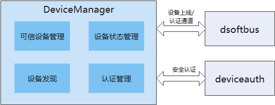

# **DeviceManager部件**

## 简介

DeviceManager组件在OpenHarmony上提供账号无关的分布式设备的认证组网能力，并为开发者提供了一套用于分布式设备间监听、发现和认证的接口。

其组成及依赖如下所示：



dsoftbus提供能力：
    提供设备上下线通知及设备信息，设备认证通道和设备发现能力。
deviceauth提供能力：
    提供设备群组管理和群组认证能力。


## 目录

```
foundation/distributedhardware/distributedhardware_device_manager
├── common                        # 公共能力头文件存放目录
│   ├── include
│   │   ├── dfx                   # dfx功能头文件存放目录
│   │   └── ipc                   # ipc功能头文件存放目录
│   │       ├── lite              # small
│   │       ├── model             # ipc功能模块头文件存放目录
│   │       └── standard          # standard
│   └── src
│       ├── dfx                   # dfx功能实现相关代码
│       └── ipc                   # ipc公共功能代码
│           ├── lite              # small
│           └── standard          # standard
├── display                       # DM显示hap代码
│   └── entry
│       └── src
│           └── main
│               ├── js            # DM PIN码显示ServiceExtensionAbility相关JS代码
│               └── resources     # DM PIN码显示ServiceExtensionAbility相关资源配置文件目录
├── figures
├── interfaces
│   ├── inner_kits                # 内部接口及实现存放目录
│   │   └── native_cpp            # 内部native接口及实现存放目录
│   │       ├── include
│   │       │   ├── ipc           # ipc头文件存放目录
│   │       │   │   ├── lite      # small
│   │       │   │   └── standard  # standard
│   │       │   └── notify        # ipc回调通知头文件目录
│   │       └── src
│   │           ├── ipc           # ipc功能代码
│   │           │   ├── lite      # small
│   │           │   └── standard  # standard
│   │           └── notify        # ipc回调通知功能代码
│   └── kits                      # 外部接口及实现存放目录
│       └── js                    # 外部JS接口及实现存放目录
│           ├── include           # 外部JS接口及实现头文件存放目录
│           └── src               # 外部JS接口及实现代码
├── sa_profile                    # SA进程配置相关文件存放目录
├── services
│   ├── implementation            # devicemanagerservice服务实现核心代码
│   │   ├── include
│   │   │   ├── ability           # 与PIN码显示ServiceExtensionAbility拉起管理相关头文件
│   │   │   ├── adapter           # DM适配扩展功能相关头文件
│   │   │   ├── authentication    # device_auth交互相关头文件
│   │   │   ├── config            # DM适配扩展相关配置功能头文件
│   │   │   ├── credential        # 凭据管理功能相关头文件
│   │   │   ├── dependency        # 外部依赖模块相关头文件
│   │   │   │   ├── commonevent   # 事件处理功能相关头文件
│   │   │   │   ├── hichain       # 与hichain功能交互相关头文件
│   │   │   │   ├── mini          # mini
│   │   │   │   ├── multipleuser  # 多用户功能相关头文件
│   │   │   │   ├── softbus       # 与软总线功能交互相关头文件
│   │   │   │   └── timer         # 定时器处理相关头文件
│   │   │   ├── devicestate       # 设备状态管理功能相关头文件
│   │   │   ├── discovery         # 设备发现功能相关头文件
│   │   │   ├── dispath           # L0上功能实现相关头文件
│   │   │   └── publish           # 设备主动发现功能相关头文件
│   │   └── src
│   │       ├── ability           # 与PIN码显示ServiceExtensionAbility拉起管理相关功能代码
│   │       ├── adapter           # DM适配扩展功能代码
│   │       ├── authentication    # device_auth交互相关核心代码
│   │       ├── config            # DM适配扩展相关配置功能代码
│   │       ├── credential        # 凭据管理功能代码
│   │       ├── dependency        # 外部依赖模块功能代码
│   │       │   ├── commonevent   # 事件处理功能代码
│   │       │   ├── hichain       # 与hichain功能交互代码
│   │       │   ├── mini          # mini
│   │       │   ├── multipleuser  # 多用户功能代码
│   │       │   ├── softbus       # 与软总线功能交互代码
│   │       │   └── timer         # 定时器处理相关功能代码
│   │       ├── devicestate       # 设备状态管理功能代码
│   │       ├── discovery         # 设备发现功能代码
│   │       ├── dispath           # mini上功能实现代码
│   │       └── publish           # 设备主动发现功能
│   └── service                   # devicemanagerservice服务实现核心代码
│       ├── include
│       │   ├── ipc               # 进程间通信相关头文件
│       │   │   ├── lite          # small
│       │   │   └── standard      # standard
│       │   └── softbus           # 软总线相关头文件
│       └── src
│           ├── ipc               # 进程间通信相关功能代码
│           │   ├── lite          # small
│           │   └── standard      # standard
│           └── softbus           # 通道建立功能核心代码
└── utils                         # 公共能力头文件存放目录
    ├── include
    │   ├── fwkload               # 拉起其他sa功能相关头文件
    │   └── permission            # 权限校验相关头文件存放目录
    └── src
        ├── fwkload               # 拉起其他sa功能相关功能代码
        └── permission            # 权限校验相关功能代码
```

## 约束

- 开发语言：JS、C++
- 适用于Hi3516DV300单板等OpenHarmony设备


## 接口说明

当前版本设备管理服务不具备权限管理的能力，接口中的system api仅供系统调用，后续版本会进行严格的权限管控。
接口参见[**interface_sdk-js仓库的**](https://gitee.com/openharmony/interface_sdk-js/) *ohos.distributedHardware.deviceManager.d.ts*

- 公共接口：

  使用DeviceManager相关接口之前，需要通过createDeviceManager接口创建DeviceManager实例；

  不使用DeviceManager接口的时候需要释放对应的DeviceManager实例。

| 原型                                                         | 描述                            |
| ------------------------------------------------------------ | ------------------------------- |
| createDeviceManager(bundleName: string, callback: AsyncCallback<DeviceManager>): void; | 以异步方法获取DeviceManager实例 |
| release(): void;                                             | 释放DeviceManager实例           |


- 系统能力接口：

  提供可信设备列表获取、可信设备状态监听、周边设备发现、设备认证等相关接口，该部分作为系统能力接口，仅供系统应用调用。

  开始设备发现、停止发现设备接口要配对使用，使用同一个subscribeId。

| 原型                                                         | 描述                 |
| ------------------------------------------------------------ | -------------------- |
| getTrustedDeviceListSync(): Array<DeviceInfo>;                                                                                            | 获取信任设备列表 |
| on(type: 'deviceStateChange', callback: Callback<{ action: DeviceStateChangeAction, device: DeviceInfo }>): void;                         | 设备状态变更回调 |
| off(type: 'deviceStateChange', callback?: Callback<{ action: DeviceStateChangeAction, device: DeviceInfo }>): void;                       | 取消设备状态变更回调 |
| on(type: 'serviceDie', callback: () => void): void;                                                                                       | 服务错误回调 |
| off(type: 'serviceDie', callback?: () => void): void;                                                                                     | 取消服务错误回调 |
| startDeviceDiscovery(subscribeInfo: SubscribeInfo): void;    | 开始设备发现         |
| stopDeviceDiscovery(subscribeId: number): void;              | 停止发现设备         |
| authenticateDevice(deviceInfo: DeviceInfo, authparam: AuthParam, callback: AsyncCallback<{deviceId: string, pinTone ?: number}>): void; | 设备认证接口         |
| setUserOperation(operateAction: number, params: string): void;    | 设置用户ui操作行为         |
| verifyAuthInfo(authInfo: AuthInfo, callback: AsyncCallback<{deviceId: string, level: number}>): void; | 设备认证信息校验     |
| on(type: 'deviceFound', callback: Callback<{ subscribeId: number, device: DeviceInfo }>): void; | 发现设备列表回调     |
| off(type: 'deviceFound', callback?: Callback<{ subscribeId: number, device: DeviceInfo }>): void; | 取消发现设备列表回调 |
| on(type: 'discoverFail', callback: Callback<{ subscribeId: number, reason: number }>): void; | 发现设备失败回调     |
| off(type: 'discoverFail', callback?: Callback<{ subscribeId: number, reason: number }>): void; | 取消发现设备失败回调 |
| on(type: 'publishSuccess', callback: Callback<{ publishId: number }>): void; | 发布设备成功回调     |
| off(type: 'publishSuccess', callback?: Callback<{ publishId: number }>): void; | 取消发布设备成功回调 |
| on(type: 'publishFail', callback: Callback<{ publishId: number, reason: number }>): void; | 发布设备失败回调     |
| off(type: 'publishFail', callback?: Callback<{ publishId: number, reason: number  }>): void; | 取消发布设备失败回调 |
| on(type: 'uiStateChange', callback: Callback<{ param: string}>): void; | ui状态变更回调     |
| off(type: 'uiStateChange', callback?: Callback<{ param: string}>): void; | 取消ui状态变更回调     |
- 示例如下：

```js
// 创建DeviceManager实例：
deviceManager.createDeviceManager('com.ohos.xxxx', (err, dm) => {
    this.log("createDeviceManager err:" + JSON.stringify(err) + '  --success:' + JSON.stringify(dm))
    if (err) return;
    dmClass = dm;
    dmClass.on('serviceDie', data => this.log("serviceDie on:" + JSON.stringify(data)))
});

// 注册/去注册设备上下线监听
dmClass.on('deviceStateChange', (data) => {
    this.log("deviceStateChange on:" + JSON.stringify(data));
    switch (data.action) {
      case ONLINE:
        // 设备物理上线状态
        break;
      case READY:
        // 设备可用状态，表示设备间信息已在分布式数据中同步完成，可以运行分布式业务
        break;
      case OFFLINE:
        // 设备物理下线状态
        break;
      case CHANGE:
        // 设备信息变更
        break;
      default:
        break;
    }
});
dmClass.off('deviceStateChange')

// 查询可信设备列表
var array = dmClass.getTrustedDeviceListSync();

// 获取本地设备信息
var localDeviceInfo = dmClass.getLocalDeviceInfoSync();

// 开始设备发现（发现周边不可信设备）
var subscribeId = 0;
dmClass.on('deviceFound', (data) => {
    if (data == null) {
        this.log("deviceFound error data=null")
        return;
    }
    this.logList.push("deviceFound:" + JSON.stringify(data));
});
dmClass.on('discoverFail', (data) => {
    this.log("discoverFail on:" + JSON.stringify(data));
});
subscribeId = Math.floor(Math.random() * 10000 + 1000)
var info = {
    "subscribeId": subscribeId,
    "mode": 0xAA,
    "medium": 0,
    "freq": 2,
    "isSameAccount": false,
    "isWakeRemote": true,
    "capability": 0
};
var filterOptions = {
    "filter_op": "OR", //可选，默认"OR"
    "filters": [
        {
            "type": "range",
            "value": 50 // 需要过滤发现设备的距离，单位(cm)
        }
    ]
};
dmClass.startDeviceDiscovery(info, JSON.stringify(filterOptions));

// 停止设备发现（需要和startDeviceDiscovery接口配对使用）
dmClass.stopDeviceDiscovery(subscribeId);

// 开始发布设备发现
var publishId = 0;
dmClass.on('publishSuccess', (data) => {
    if (data == null) {
        this.log("publishSuccess error data=null")
        return;
    }
    this.logList.push("publishSuccess:" + JSON.stringify(data));
});
dmClass.on('publishFailed', (data) => {
    this.log("publishFailed on:" + JSON.stringify(data));
});
publishId = Math.floor(Math.random() * 10000 + 1000)
var info = {
    "publishId": publishId,
    "mode": 0xAA,
    "freq": 2,
    "ranging": 1
};
dmClass.publishDeviceDiscovery(info);

// 停止发布设备发现（需要和publishDeviceDiscovery接口配对使用）
dmClass.unPublishDeviceDiscovery(publishId);

// 设置用户ui操作行为
/*  operateAction = 0 - 允许授权
    operateAction = 1 - 取消授权
    operateAction = 2 - 授权框用户操作超时
    operateAction = 3 - 取消pin码框展示
    operateAction = 4 - 取消pin码输入框展示
    operateAction = 5 - pin码输入框确定操作
*/
dmClass.setUserOperation(operation, "extra")
dmClass.on('uiStateChange', (data) => {
    console.log("uiStateChange executed, dialog closed" + JSON.stringify(data))
    var tmpStr = JSON.parse(data.param)
    this.isShow = tmpStr.verifyFailed
    console.log("uiStateChange executed, dialog closed" + this.isShow)
    if (!this.isShow) {
        this.destruction()
    }
});
dmClass.off('uiStateChange')

// 设备认证
var deviceInfo ={
    "deviceId": "XXXXXXXX",
    "deviceName": "",
    deviceType: 0
};
let extraInfo = {
    "appIcon": new Uint8Array(), // app图标，可选参数，可不填
    "appThumbnail": new Uint8Array(), // app缩略图，可选参数，可不填
    "appName": "xxxxxxxx", // 对端设备应用名称
    "appDescription": "xxxxxxxx", // app描述
    "business": '0',
    "displayOwner": 0,
}
let authParam = {
    "authType": 1,
    "extraInfo": extraInfo
}
dmClass.authenticateDevice(this.deviceInfo, authParam, (err, data) => {
    if (err) {
        this.logList.push("authenticateDevice err:" + JSON.stringify(err));
        console.info(TAG + "authenticateDevice err:" + JSON.stringify(err));
        return;
    }
    this.logList.push("authenticateDevice result:" + JSON.stringify(data));
    console.info(TAG + "authenticateDevice result:" + JSON.stringify(data));
    token = data.pinToken;
});

// 设备取消认证
dmClass.unAuthenticateDevice(this.deviceInfo);
```
## 系统弹框ServiceExtensionAbility

当前版本只支持PIN码认证，需要提供PIN码认证的授权提示界面、PIN码显示界面、PIN码输入界面；

当前，由于系统通过native层直接进行弹窗的能力尚不具备，这里使用ServiceExtensionAbility来进行对应界面的弹窗。

该ServiceExtensionAbility为：DeviceManager_UI.hap，作为系统应用进行预置。

- 编译运行：

  将devicemanager/display工程导入DevEco Studio 2.2 Beta1，复制display目录下的@ohos.distributedHardware.deviceManager.d.ts文件到Sdk\js\2.2.0.1\api\common目录下，进行编译构建及运行调试.

- 编译环境依赖：IDE 2.2 SDK6

- DeviceManager_UI.hap包源码存放位置：[device_manager仓库](https://gitee.com/openharmony/distributedhardware_device_manager/tree/master/display)

- UI显示：

  DeviceManager作为认证被控端，授权提示界面、PIN码显示界面由DeviceManager_UI ServiceExtensionAbility默认进行显示；

  DeviceManager作为认证发起端，PIN码输入界面可以选择由DeviceManager_UI ServiceExtensionAbility进行显示，还是由开发者自行显示。开发者如需自己定制PIN码输入界面，需要在authenticateDevice接口的认证参数AuthParam中，extraInfo属性里面指定displayOwner参数为1。

## 相关仓
****

[**interface_sdk-js**](https://gitee.com/openharmony/interface_sdk-js/)

[**applications_hap**](https://gitee.com/openharmony/applications_hap)
