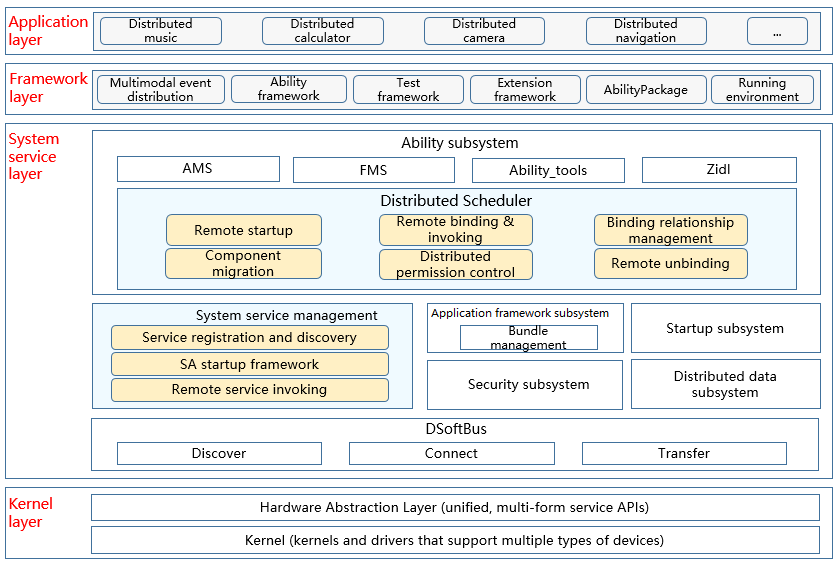

# samgr<a name="EN-US_TOPIC_0000001162068341"></a>
## Introduction<a name="section11660541593"></a>

The **samgr** module is a core module of OpenHarmony. It provides functions, such as start, registration, and query, of system abilities (also called system services).



## Directory Structure<a name="section161941989596"></a>

```
/foundation/systemabilitymgr
├── samgr
│   ├── bundle.json  # Description and build file of samgr
│   ├── frameworks   # Framework implementation
│   ├── interfaces   # APIs
│   ├── services     # Directory for samgr services
│   ├── test         # Test code
│   ├── utils        # Utils
```

## Usage<a name="section1312121216216"></a>

1.  Upon receiving a registration message from the system ability (SA) framework, the samgr service saves the system ability information in the local cache.

    ```
    int32_t SystemAbilityManager::AddSystemAbility(int32_t systemAbilityId, const sptr<IRemoteObject>& ability,
        const SAExtraProp& extraProp)
    {
        if (!CheckInputSysAbilityId(systemAbilityId) || ability == nullptr) {
            HILOGE("AddSystemAbilityExtra input params is invalid.");
            return ERR_INVALID_VALUE;
        }
        {
            unique_lock<shared_mutex> writeLock(abilityMapLock_);
            auto saSize = abilityMap_.size();
            if (saSize >= MAX_SERVICES) {
                HILOGE("map size error, (Has been greater than %zu)", saSize);
                return ERR_INVALID_VALUE;
            }
            SAInfo saInfo;
            saInfo.remoteObj = ability;
            saInfo.isDistributed = extraProp.isDistributed;
            saInfo.capability = extraProp.capability;
            saInfo.permission = Str16ToStr8(extraProp.permission);
            abilityMap_[systemAbilityId] = std::move(saInfo);
            HILOGI("insert %{public}d. size : %{public}zu", systemAbilityId, abilityMap_.size());
        }
        RemoveCheckLoadedMsg(systemAbilityId);
        if (abilityDeath_ != nullptr) {
            ability->AddDeathRecipient(abilityDeath_);
        }

        u16string strName = Str8ToStr16(to_string(systemAbilityId));
        if (extraProp.isDistributed && dBinderService_ != nullptr) {
            dBinderService_->RegisterRemoteProxy(strName, systemAbilityId);
            HILOGD("AddSystemAbility RegisterRemoteProxy, serviceId is %{public}d", systemAbilityId);
        }
        if (systemAbilityId == SOFTBUS_SERVER_SA_ID && !isDbinderStart_) {
            if (dBinderService_ != nullptr && rpcCallbackImp_ != nullptr) {
                bool ret = dBinderService_->StartDBinderService(rpcCallbackImp_);
                HILOGI("start result is %{public}s", ret ? "succeed" : "fail");
                isDbinderStart_ = true;
            }
        }
        SendSystemAbilityAddedMsg(systemAbilityId, ability);
        return ERR_OK;
    }
    ```

2.  If the system service requested by the SA framework is a local service, the samgr service locates the proxy object of the system service based on the service ID and then returns the proxy object to the SA framework.

    ```
    sptr<IRemoteObject> SystemAbilityManager::CheckSystemAbility(int32_t systemAbilityId)
    {
        if (!CheckInputSysAbilityId(systemAbilityId)) {
            HILOGW("CheckSystemAbility CheckSystemAbility invalid!");
            return nullptr;
        }

        shared_lock<shared_mutex> readLock(abilityMapLock_);
        auto iter = abilityMap_.find(systemAbilityId);
        if (iter != abilityMap_.end()) {
            HILOGI("found service : %{public}d.", systemAbilityId);
            return iter->second.remoteObj;
        }
        HILOGI("NOT found service : %{public}d", systemAbilityId);
        return nullptr;
    }
    ```

3. The samgr service dynamically loads the system service process and system ability. Instead of starting upon system startup, the process starts when the system ability is accessed and loads the specified system ability. 
   

	3.1 Inherit from the **SystemAbilityLoadCallbackStub** class and overwrite the **OnLoadSystemAbilitySuccess(int32_t systemAbilityId, const sptr<IRemoteObject>& remoteObject)** and **OnLoadSystemAbilityFail(int32_t systemAbilityId)** methods.
	
	```
	class OnDemandLoadCallback : public SystemAbilityLoadCallbackStub {
	public:
	    void OnLoadSystemAbilitySuccess(int32_t systemAbilityId, const sptr<IRemoteObject>& remoteObject) override;
	    void OnLoadSystemAbilityFail(int32_t systemAbilityId) override;
	};
	
	void OnDemandLoadCallback::OnLoadSystemAbilitySuccess(int32_t systemAbilityId,
	    const sptr<IRemoteObject>& remoteObject) // systemAbilityId is the ID of the system ability to be loaded, and remoteObject indicates the proxy object of the system ability.
	{
	    cout << "OnLoadSystemAbilitySuccess systemAbilityId:" << systemAbilityId << " IRemoteObject result:" <<
	        ((remoteObject != nullptr) ? "succeed" : "failed") << endl;
	}
	
	void OnDemandLoadCallback::OnLoadSystemAbilityFail(int32_t systemAbilityId) // systemAbilityId is the ID of the system ability to be loaded.
	{
	    cout << "OnLoadSystemAbilityFail systemAbilityId:" << systemAbilityId << endl;
	}
	```
	
	3.2 Call **LoadSystemAbility(int32_t systemAbilityId, const sptr<ISystemAbilityLoadCallback>& callback)** provided by samgr.
	```
	// Construct a SystemAbilityLoadCallbackStub instance (mentioned in step 3.1).
	sptr<OnDemandLoadCallback> loadCallback_ = new OnDemandLoadCallback();
	// Call the LoadSystemAbility method.
	sptr<ISystemAbilityManager> sm = SystemAbilityManagerClient::GetInstance().GetSystemAbilityManager();
	if (sm == nullptr) {
	    cout << "GetSystemAbilityManager samgr object null!" << endl;
	    return;
	}
	int32_t result = sm->LoadSystemAbility(systemAbilityId, loadCallback_);
	if (result != ERR_OK) {
	    cout << "systemAbilityId:" << systemAbilityId << " load failed, result code:" << result << endl;
	    return;
	}
	```
>**NOTE**: 
>
>- After the **LoadSystemAbility** method is called, the **OnLoadSystemAbilitySuccess** callback will be invoked if the specified system ability is successfully loaded and the **OnLoadSystemAbilityFail** callback will be invoked if the system ability fails to be loaded. 
>- The dynamically loaded process cannot start upon system startup. You must set **"ondemand": true** in the .cfg file. The following is an example:
>
>```
>{
>"services" : [{
>    "name" : "listen_test",
>    "path" : ["/system/bin/sa_main", "/system/profile/listen_test.xml"],
>    "ondemand" : true,
>    "uid" : "system",
>    "gid" : ["system", "shell"]
>    }
>]
>}
>```
>- The **LoadSystemAbility** method applies to dynamic loading of system abilities. In other scenarios, use the **CheckSystemAbility** method to obtain a system ability.
>- The process name in the .cfg file must be the same as that in the .xml configuration file of the system ability.

## Repositories Involved<a name="section1371113476307"></a>

**System Ability Management Subsystem**

[systemabilitymgr\_safwk](https://gitee.com/openharmony/systemabilitymgr_safwk)

[**systemabilitymgr\_samgr**](https://gitee.com/openharmony/systemabilitymgr_samgr)

[systemabilitymgr\_safwk\_lite](https://gitee.com/openharmony/systemabilitymgr_safwk_lite)

[systemabilitymgr\_samgr\_lite](https://gitee.com/openharmony/systemabilitymgr_samgr_lite)
