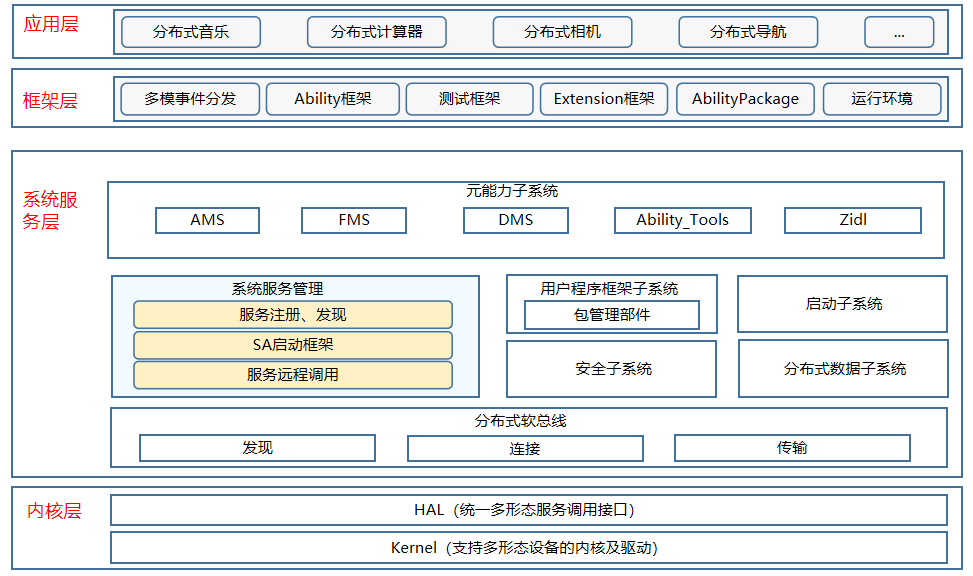

# 系统服务管理部件<a name="ZH-CN_TOPIC_0000001162068341"></a>
## 简介<a name="section11660541593"></a>

samgr组件是OpenHarmony的核心组件，提供OpenHarmony系统服务启动、注册、查询等功能。

## 系统架构<a name="section342962219551"></a>

**图 1**  系统服务管理系统架构图




## 目录<a name="section161941989596"></a>

```
/foundation/systemabilitymgr
├── samgr
│   ├── bundle.json  # 部件描述及编译文件
│   ├── frameworks   # 框架实现存在目录
│   ├── interfaces   # 接口目录
│   ├── services     # 组件服务端目录
│   ├── test         # 测试代码存放目录
│   ├── utils        # 工具类目录
```

## 说明<a name="section1312121216216"></a>

1.  samgr服务接收到sa框架层发送的注册消息，会在本地缓存中存入系统服务相关信息。

    ```
    int32_t SystemAbilityManager::AddSystemAbility(int32_t systemAbilityId, const sptr<IRemoteObject>& ability,
        const SAExtraProp& extraProp)
    {
        if (!CheckInputSysAbilityId(systemAbilityId) || ability == nullptr) {
            HILOGE("AddSystemAbilityExtra input params is invalid.");
            return ERR_INVALID_VALUE;
        }
        {
            unique_lock<shared_mutex> writeLock(abilityMapLock_);
            auto saSize = abilityMap_.size();
            if (saSize >= MAX_SERVICES) {
                HILOGE("map size error, (Has been greater than %zu)", saSize);
                return ERR_INVALID_VALUE;
            }
            SAInfo saInfo;
            saInfo.remoteObj = ability;
            saInfo.isDistributed = extraProp.isDistributed;
            saInfo.capability = extraProp.capability;
            saInfo.permission = Str16ToStr8(extraProp.permission);
            abilityMap_[systemAbilityId] = std::move(saInfo);
            HILOGI("insert %{public}d. size : %{public}zu", systemAbilityId, abilityMap_.size());
        }
        RemoveCheckLoadedMsg(systemAbilityId);
        if (abilityDeath_ != nullptr) {
            ability->AddDeathRecipient(abilityDeath_);
        }

        u16string strName = Str8ToStr16(to_string(systemAbilityId));
        if (extraProp.isDistributed && dBinderService_ != nullptr) {
            dBinderService_->RegisterRemoteProxy(strName, systemAbilityId);
            HILOGD("AddSystemAbility RegisterRemoteProxy, serviceId is %{public}d", systemAbilityId);
        }
        if (systemAbilityId == SOFTBUS_SERVER_SA_ID && !isDbinderStart_) {
            if (dBinderService_ != nullptr && rpcCallbackImp_ != nullptr) {
                bool ret = dBinderService_->StartDBinderService(rpcCallbackImp_);
                HILOGI("start result is %{public}s", ret ? "succeed" : "fail");
                isDbinderStart_ = true;
            }
        }
        SendSystemAbilityAddedMsg(systemAbilityId, ability);
        return ERR_OK;
    }
    ```

2.  对于本地服务而言，samgr服务接收到sa框架层发送的获取消息，会通过服务id，查找到对应服务的代理对象，然后返回给sa框架。

    ```
    sptr<IRemoteObject> SystemAbilityManager::CheckSystemAbility(int32_t systemAbilityId)
    {
        if (!CheckInputSysAbilityId(systemAbilityId)) {
            HILOGW("CheckSystemAbility CheckSystemAbility invalid!");
            return nullptr;
        }

        shared_lock<shared_mutex> readLock(abilityMapLock_);
        auto iter = abilityMap_.find(systemAbilityId);
        if (iter != abilityMap_.end()) {
            HILOGI("found service : %{public}d.", systemAbilityId);
            return iter->second.remoteObj;
        }
        HILOGI("NOT found service : %{public}d", systemAbilityId);
        return nullptr;
    }
    ```

3. 动态加载系统服务进程及SystemAbility, 系统进程无需开机启动，而是在SystemAbility被访问的时候按需拉起，并加载指定SystemAbility。  
    3.1 继承SystemAbilityLoadCallbackStub类，并覆写OnLoadSystemAbilitySuccess(int32_t systemAbilityId, const sptr<IRemoteObject>& remoteObject)、OnLoadSystemAbilityFail(int32_t systemAbilityId)方法。
    
    ```
    class OnDemandLoadCallback : public SystemAbilityLoadCallbackStub {
    public:
        void OnLoadSystemAbilitySuccess(int32_t systemAbilityId, const sptr<IRemoteObject>& remoteObject) override;
        void OnLoadSystemAbilityFail(int32_t systemAbilityId) override;
    };
    
    void OnDemandLoadCallback::OnLoadSystemAbilitySuccess(int32_t systemAbilityId,
        const sptr<IRemoteObject>& remoteObject) // systemAbilityId为指定加载的SAID，remoteObject为指定systemAbility的代理对象
    {
        cout << "OnLoadSystemAbilitySuccess systemAbilityId:" << systemAbilityId << " IRemoteObject result:" <<
            ((remoteObject != nullptr) ? "succeed" : "failed") << endl;
    }
    
    void OnDemandLoadCallback::OnLoadSystemAbilityFail(int32_t systemAbilityId) // systemAbilityId为指定加载的SAID
    {
        cout << "OnLoadSystemAbilityFail systemAbilityId:" << systemAbilityId << endl;
    }
    ```
    
    3.2 调用samgr提供的动态加载接口LoadSystemAbility(int32_t systemAbilityId, const sptr<ISystemAbilityLoadCallback>& callback)。
    ```
    // 构造步骤1的SystemAbilityLoadCallbackStub子类的实例
    sptr<OnDemandLoadCallback> loadCallback_ = new OnDemandLoadCallback();
    // 调用LoadSystemAbility方法
    sptr<ISystemAbilityManager> sm = SystemAbilityManagerClient::GetInstance().GetSystemAbilityManager();
    if (sm == nullptr) {
        cout << "GetSystemAbilityManager samgr object null!" << endl;
        return;
    }
    int32_t result = sm->LoadSystemAbility(systemAbilityId, loadCallback_);
    if (result != ERR_OK) {
        cout << "systemAbilityId:" << systemAbilityId << " load failed, result code:" << result << endl;
        return;
    }
    ```
>说明：  
>1.LoadSystemAbility方法调用成功后，指定SystemAbility加载成功后会触发回调OnLoadSystemAbilitySuccess，加载失败触发回调OnLoadSystemAbilityFail。  
>2.动态加载的进程cfg文件不能配置为开机启动，需指定"ondemand" : true, 示例如下:
>```
>{
>     "services" : [{
>         "name" : "listen_test",
>         "path" : ["/system/bin/sa_main", "/system/profile/listen_test.xml"],
>         "ondemand" : true,
>         "uid" : "system",
>         "gid" : ["system", "shell"]
>         }
>     ]
>}
>```
>3.LoadSystemAbility方法适用于动态加载场景，其他获取SystemAbility场景建议使用CheckSystemAbility方法。  
>4.cfg里进程名称需要与SA的配置xml文件里进程名保持一致

## 相关仓<a name="section1371113476307"></a>

系统服务管理子系统

[systemabilitymgr\_safwk](https://gitee.com/openharmony/systemabilitymgr_safwk)

[**systemabilitymgr\_samgr**](https://gitee.com/openharmony/systemabilitymgr_samgr)

[systemabilitymgr\_safwk\_lite](https://gitee.com/openharmony/systemabilitymgr_safwk_lite)

[systemabilitymgr\_samgr\_lite](https://gitee.com/openharmony/systemabilitymgr_samgr_lite)

