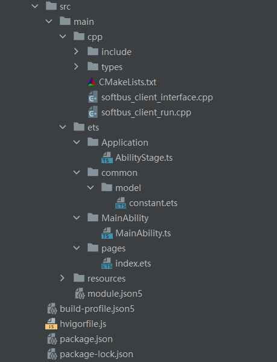
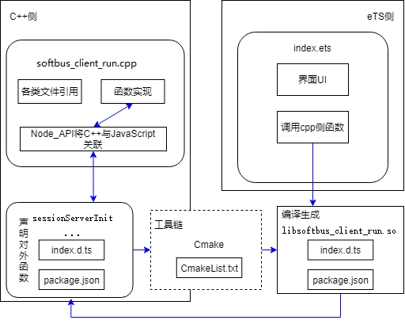

# 1.介绍

该仓库主要为openHarmony使用分布式软总线和openEuler设备通信的客户端应用demo，应用采用了"Native C++"工程，界面使用eTS语言开发，通过C++调用分布式软总线提供的so库中的接口，经过native封装后再提供给eTS调用。该工程在openHarmony开发板上运行界面如下：


**功能说明：**

- 当有已认证的设备组网成功时，将在“终端”展示框中展示设备图标，点击可查看设备基本信息。

- 当接收到openEuler设备发送的消息时，将在屏幕上方展示。

- 点击“发送数据”按钮将会往组网的openEuler设备发送“Hello openEuler"消息。

# 2.相关概念

[Node\_API](https://gitee.com/openharmony/docs/blob/master/zh-cn/application-dev/reference/native-lib/third_party_napi/napi.md) ：用于封装JavaScript能力为native插件的API，独立于底层JavaScript，并作为Node.js的一部分。

[Native API中支持的标准库](https://gitee.com/openharmony/docs/blob/master/zh-cn/application-dev/reference/native-lib/third_party_libc/musl.md) ：目前支持标准C库、C++库、OpenSL ES、zlib。

[分布式软总线常用库函数](https://openeuler.gitee.io/yocto-meta-openeuler/features/distributed_softbus.html) ：discovery_service.h、softbus_bus_center.h、session.h。

[Cmake](https://cmake.org/cmake/help/latest/) ：管理源代码构建的工具。

# 3.搭建OpenHarmony环境

完成本篇Codelab我们首先要完成开发环境的搭建，本示例以**RK3568**开发板为例，参照以下步骤进行：

1.  [获取OpenHarmony系统版本](https://gitee.com/openharmony/docs/blob/master/zh-cn/device-dev/get-code/sourcecode-acquire.md#%E8%8E%B7%E5%8F%96%E6%96%B9%E5%BC%8F3%E4%BB%8E%E9%95%9C%E5%83%8F%E7%AB%99%E7%82%B9%E8%8E%B7%E5%8F%96) ：标准系统解决方案（二进制）。

    以3.1版本为例：

    

2.  搭建烧录环境。
    1.  [完成DevEco Device Tool的安装](https://gitee.com/openharmony/docs/blob/master/zh-cn/device-dev/quick-start/quickstart-standard-env-setup.md)
    2.  [完成RK3568开发板的烧录](https://gitee.com/openharmony/docs/blob/master/zh-cn/device-dev/quick-start/quickstart-ide-standard-running-rk3568-burning.md)

3.  搭建开发环境。
    1.  开始前请参考[工具准备](https://gitee.com/openharmony/docs/blob/master/zh-cn/application-dev/quick-start/start-overview.md#%E5%B7%A5%E5%85%B7%E5%87%86%E5%A4%87) ，完成DevEco Studio的安装和开发环境配置。
    2.  开发环境配置完成后，请参考[使用工程向导](https://gitee.com/openharmony/docs/blob/master/zh-cn/application-dev/quick-start/start-with-ets-stage.md#%E5%88%9B%E5%BB%BAets%E5%B7%A5%E7%A8%8B) 创建工程（模板选择“Native C++”），选择JS或者eTS语言开发。
    3.  工程创建完成后，选择使用[真机进行调测](https://gitee.com/openharmony/docs/blob/master/zh-cn/application-dev/quick-start/start-with-ets-stage.md#%E4%BD%BF%E7%94%A8%E7%9C%9F%E6%9C%BA%E8%BF%90%E8%A1%8C%E5%BA%94%E7%94%A8) 。

# 4.代码结构解读

本篇文章只对核心代码进行讲解，整个工程的代码结构如下，Native C++ 工程详解见[官方文档](https://developer.harmonyos.com/cn/docs/documentation/doc-guides-V3/device_template-0000001053702407-V3?catalogVersion=V3)：



文件说明如下：

```
├── src
│   └── main
│       ├── resources                           //静态资源文件夹
│       │   └── base
│       │       ├── profile
│       │       │   └── main_pages.json         //展示页面配置文件
│       │       ├── media
│       │       └── element
│       ├── module.json5                        //模块配置文件
│       ├── ets  //ets代码区
│       │   ├── pages  
│       │   │   └── index.ets                   // 主页面
│       │   ├── MainAbility
│       │   │   └── MainAbility.ts              // Ability，提供对Ability生命周期、上下文环境等调用管理
│       │   ├── common
│       │   │   └── model
│       │   │       └── constant.ets
│       │   └── Application
│       │       └── AbilityStage.ts             // Hap包运行时类
│       └── cpp  //c++代码区
│           ├── types
│           │   └── libsoftbus_client_run
│           │       ├── package.json            // 接口注册配置文件
│           │       └── index.d.ts              // 提供给eTS的Native接口配置文件
│           ├── softbus_client_run.cpp          // Native 封装接口实现类
│           ├── softbus_client_interface.cpp    // 分布式软总线接口封装类
│           ├── include  // 头文件代码区
│           │   ├── softbus_errcode.h           // 分布式软总线公共错误码头文件
│           │   ├── softbus_common.h            // 分布式软总线常用结构头文件
│           │   ├── softbus_client_interface.h  // softbus_client_interface.cpp 头文件
│           │   ├── softbus_bus_center.h        // 组网模块头文件
│           │   ├── session.h                   // 连接/传输模块头文件
│           │   └── discovery_service.h         // 发现模块头文件
│           └── CMakeLists.txt                  // c++代码编译配置文件
```

# 5.流程解读

1.  应用架构。

    整个应用架构可以分为三部分：C++侧、eTS侧、工具链。

    -   C++侧：包含各种文件的引用、C++或者C代码、Node\_API将C++函数与JavaScript关联的信息等。
    -   eTS侧：包含界面UI、自身方法，调用引用包的方法等。
    -   工具链：包含Cmake打包工具在内的系列工具。

    在eTS调用C++方法的过程中，需要使用到[Node\_API](https://gitee.com/openharmony/docs/blob/master/zh-cn/application-dev/reference/native-lib/third_party_napi/napi.md) 、[Cmake](https://cmake.org/cmake/help/latest/) 等工具来做中间转换，整个架构及其关联关系如下：

    

    > **说明：**
    >在上面的示意图中，softbus_client_run.cpp、softbus_client_interface.cpp文件用来编写C++代码，并通过Node\_API将C++函数与JavaScript方法关联。C++代码通过Cmake打包工具打包成动态链接库SO文件,并通过index.d.ts文件对外提供接口。eTS端通过引入SO包的方式去调用SO文件中的接口。

2.  调用、打包流程。

    在eTS调用C++方法的过程中，调用、打包流程如下：

    

    > **说明：**
    >上图中C++代码通过Cmake打包成SO文件后可以直接被eTS侧引入，最终通过hivgor一起打包成可执行的OpenHarmony hap包。

    重点环节说明如下：

    - ①cpp源码编写，Node\_API将C++函数与JavaScript方法关联，index.d.ts接口文档，package.json文件编写。

      （1）c++编写分布式软总线客户端，调用分布式软总线服务端提供的接口，进行服务发布，设备探测，设备组网，消息发送等操作，具体代码见softbus_client_run.cpp和softbus_client_interface.cpp。

      ```c++
      static string sessionServerInit(callBack *func) {
          int ret;
      
          // 创建sessionServer
          ret = CreateSessionServerInterface(func);
          if (ret) {
          OH_LOG_ERROR(LOG_APP, "[ERROR] <CreateSessionServerInterface> failed");
              return "<CreateSessionServerInterface> failed";
      }
          ...
  }
      ```
    
      （2）Node\_API将C++函数与JavaScript方法关联。将C++的“sessionServerInitC”等函数进行注册，注册的对外接口名为“sessionServerInit”等。
    
      ```c++
      static napi_value Init(napi_env env, napi_value exports) {
          napi_property_descriptor desc[] = {
              {"sessionServerInit", nullptr, sessionServerInitC, nullptr, nullptr, nullptr, napi_default, nullptr},
          {"sessionConnect", nullptr, sessionConnectC, nullptr, nullptr, nullptr, napi_default, nullptr},
              {"sendData", nullptr, sendDataC, nullptr, nullptr, nullptr, napi_default, nullptr},
          {"sessionDisconnect", nullptr, sessionDisconnectC, nullptr, nullptr, nullptr, napi_default, nullptr},
          };
          ...
      }
  ```
    
  （3）index.d.ts接口文档编写，将注册的接口发布给eTS。
    
      ```javascript
      export const sessionServerInit: () => string;
      export const sessionConnect: () => string;
      export const sendData: (a: string, b: string, c: number) => number;
      export const sessionDisconnect: () => void;
  ```
    
  （4）package.json文件编写，指定eTS使用的so库。
    
      ```json
      {
    "name": "libsoftbus_client_run.so",
        "types": "./index.d.ts"
  }
      ```
    
    -   ②Cmake打包配置、CmakeList.txt配置需要添加的softbus_client_interface.cpp等源码文件以及依赖的头文件和so库。
    
        ```
        add_library(${PROJECT_NAME} SHARED softbus_client_interface.cpp softbus_client_run.cpp)
        ```
    
    -   ③index.ets中引入so文件，调用so文件中的sessionServerInit等方法。
    
        ```javascript
        import prompt from '@ohos.prompt';
        import hilog from '@ohos.hilog';
        import softbus_client_run from 'libsoftbus_client_run.so'
        var thisOld
        
        @Entry
        @Component
        struct Index {
        ...
        build() {
            Stack() {
              Column() {
                Row() {
                  if (thisOld.hasNewData) {
                    Text(thisOld.receiveData)
                      .fontSize(16)
                      .fontColor($r('app.color.white'))
                  }
                }
                .justifyContent(FlexAlign.Center)
                .width('100%')
                .height('8%')
                .padding(10)
                .backgroundColor($r('app.color.transparent_grey'))
        ...
        ```

# 6.附录

通过本篇Codelab我们了解了C++代码如何与JS实现关联，eTS如何调用SO包中的接口等，同时也掌握了C++代码的具体编写与打包流程。

分布式软总线客户端编写指导可参考：[openEuler分布式软总线](https://openeuler.gitee.io/yocto-meta-openeuler/features/distributed_softbus.html)

知识点：

-   Node\_API
-   Native API中支持的标准库
-   C常用函数库
-   Cmake

